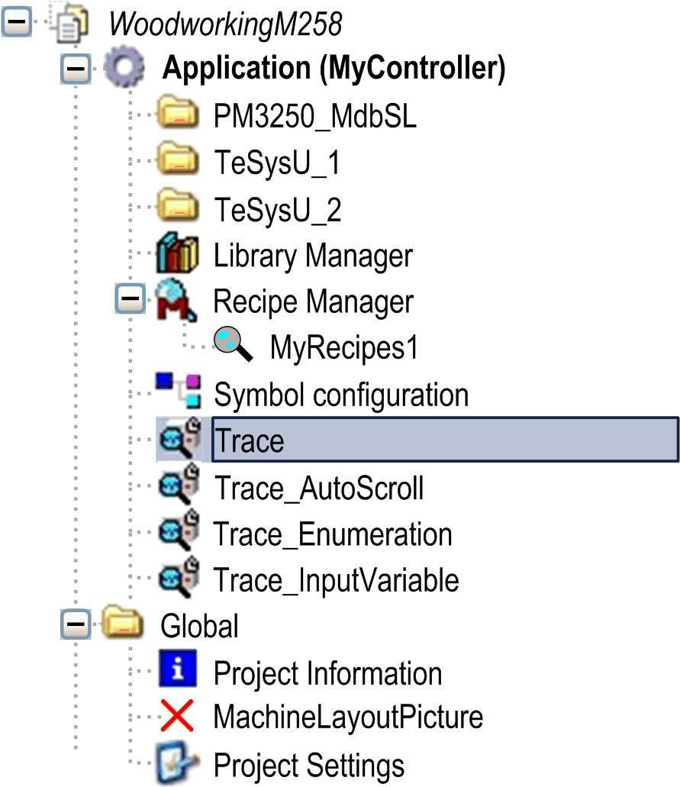

# Trace Basics

## Trace Functionality

The trace functionality allows you to capture the progression of the values of variables on the controller over a certain time, similar to a digital sampling oscilloscope. Additionally, you can set a trigger to control the data capturing with input (trigger) signals. The values of trace variables are steadily written to a buffer of a specified size. They can be observed in the form of a two-dimensional graph plotted as a function of time.

NOTE: The tracing of data is continued when you log off the controller.

If PC processor-consuming tasks are executed on the PC running EcoStruxure Machine Expert while a trace is running, it may happen that some of the variable values are not captured by the trace.

| NOTICE | |
| --- | --- |
|  | LOSS OF DATA  Avoid executing actions and/or PC applications that lead to a high CPU load while running a trace.  Failure to follow these instructions can result in equipment damage. |

## Way of Tracing Data

The tracing of data on the control is performed in two different ways:

* Either from IEC code generated by the trace object and downloaded to the controller by a trace child application.
* Or within the CmpTraceMgr component (also named Trace Manager).

NOTE: The tracing of data can significantly increase the cycle time of the IEC task.

What data is captured is determined by an entry in the target settings (trace > trace manager).

The trace manager has advanced functionality. It allows you to:

* Configure and trace parameters of the control system, such as the temperature curve of the processor or the battery. For more information, refer to the [variable settings](D-SE-0083562.html#D-SE-0083562) and to the [record (trigger) settings](D-SE-0083563.html#D-SE-0083563).
* Read out device traces, such as the trace of the electric current of a drive. For more information, refer to the description of the Upload Trace [command](../../../../../api/crossBook?lang=en-US&virtualBookName=SoMMenu&topicID=D_SE_0084188).
* Trace system variables of other system components.

Furthermore, the additional [command](../../../../../api/crossBook?lang=en-US&virtualBookName=SoMMenu&topicID=D_SE_0084188) Online List is available.

NOTE:

* If a trace is used in the visualization, device parameters cannot be traced or used for the trigger.
* The trigger level cannot be set to an IEC expression, only literals and constants are supported.
* The record condition cannot be set to an IEC expression of type BOOL, only variables are supported.
* If a property is traced or used for the trigger, it must be annotated with the [attribute monitoring](D-SE-0083639.html#D-SE-0083639) in IEC declaration.

## Configuration

Configure the trace data as well as the display settings of the trace data in the Configuration. It provides commands for accessing the configuration dialog boxes. Several variables can be traced and displayed at the same time, in different views such as multi-channel mode. Record traces of variables with different trigger settings in their own trace object. You can create any number of trace objects.

Tools tree with several trace objects

Commands for modifying the settings of the display are described in the [*Features* paragraph](D-SE-0083560.html#D-SE-0083560__D-SE-0083560.4). Zooming functionalities and a cursor are available as well as commands for running the trace so that the graph can be compressed or stretched.

To integrate the readout of a trace within a visualization, use the visualization element Trace.

For further information on trace configuration for data recording, refer to the [*Record Settings*](D-SE-0083563.html#D-SE-0083563).

EIO0000002854.09