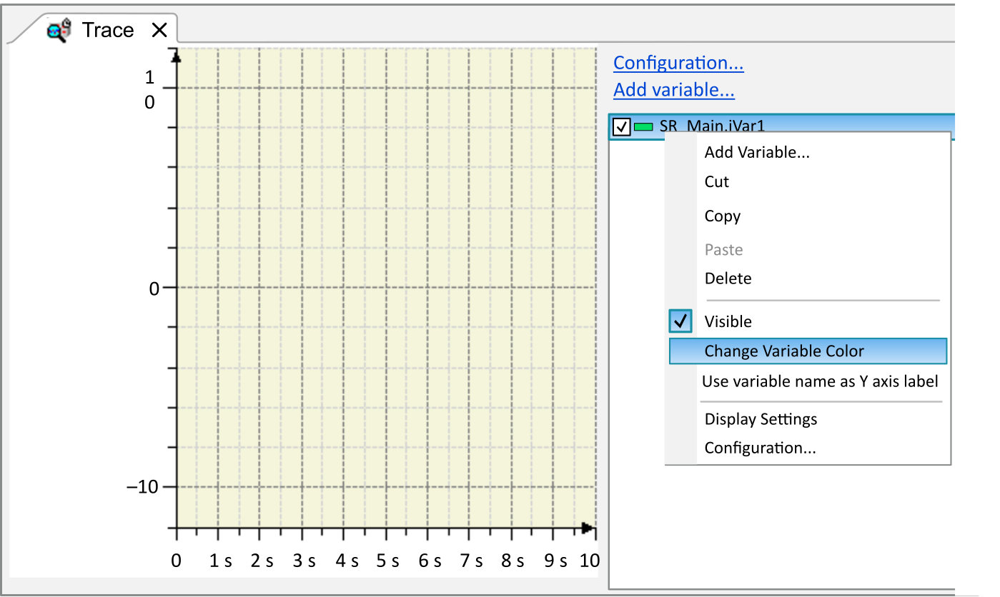
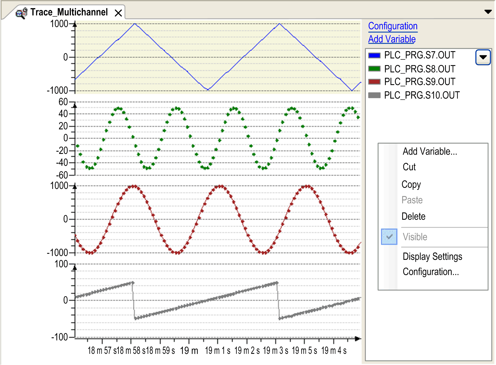

# Creating a Trace or a Device Trace Object

## Overview

To insert a trace object in the Tools tree, select the Application node, click the green plus button, and execute the command Trace.... Double-click the Trace node in the Tools tree to open the trace editor. Trace and DeviceTrace objects display trace data in one or more diagrams.

A DeviceTrace node, in particular, is inserted below the device in the Devices tree and does not immediately depend on the applications of the project. It directly accesses traces that are running on the controller.

## Trace Variable Tree

The trace variable tree provides an overview of the trace configuration. The diagrams with the respective trace variables are displayed. Double-click a trace variable to open the Trace Configuration dialog box with the variable settings.

Click the triangle and select Hide Instance Paths. The variable is displayed in the tree without the full instance path. Example: `iCounter`

The tree view of the diagrams provides the following information:

| Element | Description |
| --- | --- |
| Name | Diagrams are listed with the respective variables:   * Select Diagram <n> to display the diagram. You can rename the diagram by editing the diagram name. * Select <variable> to display the variable. You can rename the variable by editing the variable name.   A Diagram <n> selected in the tree is also selected in the editor and vice versa. |
| Cursor <n> | Indicates the Y value at the cursor position. |
| Delta | Indicates the delta of the Y value between Cursor 1 and Cursor 2. |
| Multiselection | Diagrams selected simultaneously can be expanded and collapsed with the number pad keys \* and /. |

You can drag the diagrams and variables to sort them or move them to other diagrams. Hold down the Ctrl key to copy a variable. This is also available in online mode.

## Configuration

Newly created trace with contextual menu:

A trace contains at least one variable which is sampled.

In the trace tree area in the right part of the window, the configured trace variables are displayed. By default, the trace variables are displayed with their complete instance path.

Select the Hide instance paths check box to hide the instance path. To display this check box, click the arrow button in the upper right corner of the trace tree area.

Select the Hide diagrams check box to hide the diagrams in the trace tree area.

To configure or modify the trace settings, use the commands of the contextual menu in the trace tree area:

* Add Variable...: Opens the Trace Configuration dialog box with [**Variable Settings**](D-SE-0083562.html#D-SE-0083562).
* Delete: Deletes the selected variable. Only available if at least one trace variable exists.
* Visible: This command makes the selected variable visible. Only available if at least one trace variable exists.
* Configuration...: Opens the Trace Configuration dialog box with [**Record Settings**](D-SE-0083563.html#D-SE-0083563).
* Display Settings...: Opens the Display Mode [view](D-SE-0088064.html#D-SE-0088064). It allows you to configure the appearance of the graph and the coordinate system. This command is unavailable until a configuration is loaded.

## Features

For running the trace, use the following commands:

* [**Add variable**](../../../../../api/crossBook?lang=en-US&virtualBookName=SoMMenu&topicID=D_SE_0084185)
* [**Download Trace**](../../../../../api/crossBook?lang=en-US&virtualBookName=SoMMenu&topicID=D_SE_0084185)
* [**Start/Stop Trace**](../../../../../api/crossBook?lang=en-US&virtualBookName=SoMMenu&topicID=D_SE_0084185)
* [**Reset Trigger**](../../../../../api/crossBook?lang=en-US&virtualBookName=SoMMenu&topicID=D_SE_0084185)

For customizing the view of the graphs, use the following commands:

* [**Cursor**](../../../../../api/crossBook?lang=en-US&virtualBookName=SoMMenu&topicID=D_SE_0084187)
* [**Mouse Zooming**](../../../../../api/crossBook?lang=en-US&virtualBookName=SoMMenu&topicID=D_SE_0084187)
* [**Reset View**](../../../../../api/crossBook?lang=en-US&virtualBookName=SoMMenu&topicID=D_SE_0084187)
* [**Auto Fit**](../../../../../api/crossBook?lang=en-US&virtualBookName=SoMMenu&topicID=D_SE_0084187)
* [**Compress**](../../../../../api/crossBook?lang=en-US&virtualBookName=SoMMenu&topicID=D_SE_0084187)
* [**Stretch**](../../../../../api/crossBook?lang=en-US&virtualBookName=SoMMenu&topicID=D_SE_0084187)
* [**Move all variables to individual diagrams**](../../../../../api/crossBook?lang=en-US&virtualBookName=SoMMenu&topicID=D_SE_0084187)
* [**Move all variables to first diagram**](../../../../../api/crossBook?lang=en-US&virtualBookName=SoMMenu&topicID=D_SE_0084187)
* For further information, refer to the [chapter](D-SE-0083569.html#D-SE-0083569) *Keyboard Operations for Trace Diagrams*.

For access to traces stored on the runtime system, use the following commands:

* [**Online List**](../../../../../api/crossBook?lang=en-US&virtualBookName=SoMMenu&topicID=D_SE_0084188)
* [**Upload Trace**](../../../../../api/crossBook?lang=en-US&virtualBookName=SoMMenu&topicID=D_SE_0084188)

For access to traces stored on the disc, use the following commands:

* [**Save Trace...**](../../../../../api/crossBook?lang=en-US&virtualBookName=SoMMenu&topicID=D_SE_0084189)
* [**Load Trace...**](../../../../../api/crossBook?lang=en-US&virtualBookName=SoMMenu&topicID=D_SE_0084189)
* [**Export symbolic trace config**](../../../../../api/crossBook?lang=en-US&virtualBookName=SoMMenu&topicID=D_SE_0084189)

## Getting Started

In order to start the trace in online mode, download the trace configuration to the controller by executing the Download Trace command. The graphs of the trace variables are displayed in the trace editor window where you can store them to an external file. This file can be reloaded to the editor. Also refer to the chapter [*Trace Editor in Online Mode*](D-SE-0083568.html#D-SE-0083568).

| Step | Action |
| --- | --- |
| 1 | Login and run the associated application.  **Result:** The application runs on the controller. |
| 2 | Download trace  **Result:** The trace graphs are immediately displayed according to the trace configuration. |
| 3 | Arrange the trace graphs, store the trace data, stop/start tracing. |

## Example

The trace editor shows an example of tracing in online mode. Four variables have been selected for display in the variables tree in the right part of the dialog.

Trace in online mode

EIO0000002854.09