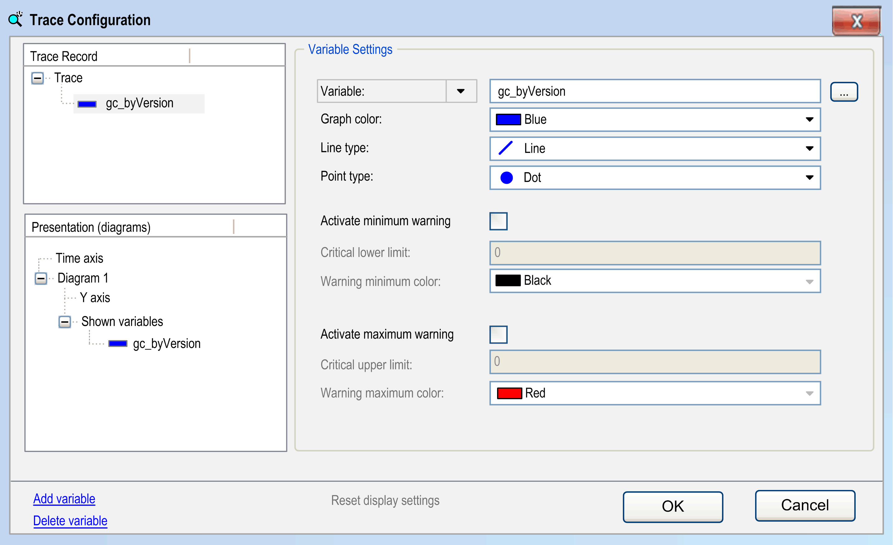

# Variable Settings

## Overview

The Trace Configuration dialog box with Variable Settings opens when you select a trace variable in the trace tree. It allows you to configure which variables should be traced and how they are displayed.

Trace Configuration dialog box with Variable Settings

The trace variables are displayed in the left part of the window in a tree structure. The top node is titled with the trace name.

## Adding and Deleting a Trace Variable

For adding a variable to the trace tree or deleting one, use the commands below the trace tree:

| Command | Description |
| --- | --- |
| Add Variable | Creates an anonymous entry in the trace tree.  In the right part of the dialog box, the settings of the new variable are ready for configuration. |
| Delete | Deletes the selected variable with the associated configuration. |

## Setting and Modifying the Variable Settings

To choose the variable settings, select the desired variable in the trace tree. The present settings will be displayed in the right part of the trace configuration window. To modify the variable settings later, select the variable entry in the trace tree and use the Variable Settings dialog box again.

| Parameter | | Description |
| --- | --- | --- |
| Variable | | Enter the name (path) of the signal to specify the signal that is traced.  A valid signal is an IEC variable, a property, a reference, the contents of a pointer, or an array element of the application. Allowed types are all IEC basic types, except STRING, WSTRING or ARRAY. Enumerations are also allowed, whose basic type is not a STRING, a WSTRING or an ARRAY. Click the ... button to open the input assistant that allows you to obtain a valid entry.  Controllers that support parameter tracing provide a list if you click the Variable: parameter. If you want to trace a device parameter, select the item Parameter from this list. Then you can find one with the help of the input assistant. Edit or verify the variable settings. Device parameters are only supported if the CmpTraceMgr component is used. If device parameters are used for trace (or for trigger) variables, it is not possible to activate the option Generate Trace POU for visualization.  NOTE: If CmpTraceMgr is used for tracing, a [Property](D-SE-0083410.html#D-SE-0083410) that is used as a trace (or trigger) variable must get the compiler attribute [Attribute Monitoring](D-SE-0083639.html#D-SE-0083639).  NOTE: Do not use Sercos parameters of type AS for tracing as this can reduce the performance of your system. |
| Graph color | | Select a color from the color selection list in which the trace curve for the variable is displayed. |
| Line type |  | Specify the way samples are connected in the graph. Use Line for large volumes of data. It is also the default value. |
|  | Line | The samples are connected to a line (default). |
| Step | The samples are connected in the shape of a staircase. Thus, a horizontal line to the time stamp of the next sample followed by a vertical line to the value of the next sample. |
| None | The samples are not connected. |
| Point type | | Specify how the values themselves are drawn in the graph. |
|  | Dot | The samples are drawn as dots (default). |
| Cross | The samples are drawn as crosses. |
| None | The samples are not displayed. |
| Activate Minimum Warning | | If this option is activated, the trace graph is displayed in the color defined in Warning minimum color as soon as the variable exceeds the value defined in Critical lower limit. |
| Critical lower limit | | If the value of the variable entered here has fallen below and Activate minimum warning is active, the values of the curve changes in the following specified color. |
| Warning minimum color | | Color value for the activated lower limit. |
| Activate Maximum Warning | | If this option is activated, the trace graph is displayed in the color defined in Warning maximum color as soon as the variable exceeds the value defined in Critical upper limit. |
| Critical upper limit | | If the value of the variable entered here is exceeded and Activate maximum warning is active, the values of the curve changes in the following specified color. |
| Warning maximum color | | Color value for the activated upper limit. |

## Multi-Selection of Variables

By using the keyboard shortcuts Shift + mouse-click or Ctrl + mouse-click, you can select several variables for editing. Then the modifications made in the dialog box Variable Settings are applied to all selected variables. The same can be achieved with Shift + Up Arrow/Down Arrow or Ctrl + Up Arrow/Down Arrow.

EIO0000002854.09