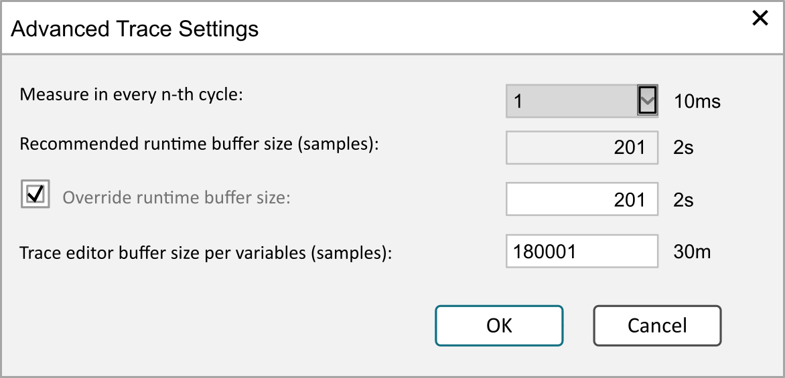

# Advanced Trace Settings

## Overview

The Advanced Trace Settings dialog box opens if you click the Advanced... button in the Trace Configuration [dialog box](D-SE-0083563.html#D-SE-0083563__D-SE-0083563.4) with Record Settings. It includes settings for the data recording, such as the size of the ring buffer on the runtime or development system that the trace editor reads. The interval that the application uses to record data is derived from the task configuration.

Advanced Trace Settings dialog box

You configure the buffer size by defining a number of samples. Using settings from the task configuration, time intervals according to the number of samples are calculated. The results are displayed on the right-hand side of each parameter.

NOTE: For the calculation to be performed, a task must be selected and the settings of the trace configuration must be set in the Trace Configuration dialog box.

## Description of the Parameters

| Parameter | Description | Comment |
| --- | --- | --- |
| Measure in every n-th cycle | Defines how often a data record is taken (every cycle, every second cycle,...). This is the scanning rate.  Default: 1 Therefore, one data set is recorded each cycle. | For example, the scanning interval of the data recording is every 10 ms. |
| Recommended runtime buffer size (samples) | The maximum number of samples that are calculated and that the runtime system can store per trace variable. The number is calculated in the task cycle time from the value in Refresh interval and the value in Measure in every n-th cycle.  The Recommended runtime buffer size (samples) is only used if the option Override runtime buffer size is not activated. | Maximum length of the time interval during which the runtime system collects data, for example, 2 s (if Refresh interval = 500 ms and Measure in every n-th cycle = 1). |
| Override runtime buffer size | When this option is selected, the application does not use value set for Recommended runtime buffer size (samples).  The number of samples per trace variable that the application records. This is the size of the runtime buffer.  Range: From 10 on, but not larger than the value set for the trace editor buffer.  Default value: 100 | Maximum length of the time interval during which the runtime system collects data, for example, 6 s. |
| Trace editor buffer size per variables (samples) | Limits the trace buffer provided by EcoStruxure Machine Expert for internal use. | – |

EIO0000002854.09