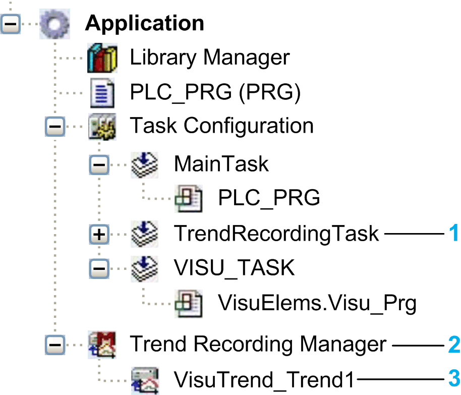

# Trend Recording Objects

## Overview

To insert a trend recording object in the Tools tree, select the Application node. Add a visualization and a trend visualization element. This function is not available for all controllers. Consult the *Programming Guide* specific to your controller for further information. In this example, a Trend Recording Manager and an object of the type a Trend Recording are added as subnodes to the Application node.

Tools tree with trend recording objects:

**1**TrendRecordingTask of the type Task

**2** Trend Recording Manager

**3** Object <name of the trend recording> of the type Trend Recording

## Trend Recording Task Object

The Trend Recording Task object extends an application by a task in which the Trend Recording Manager is executed. In the Tools tree, only one Trend Recording Manager subnode is available per Application node. The task calls the following program: `VisuTrendStorageAccess.GlobalInstances.g_TrendRecordingManager.CyclicCall`.

If you add a trend in a visualization, then the Task configuration node is extended by a Trend Recording Task object.

## Trend Recording Manager Object

The Trend Recording Manager object extends an application by the long-term data storage function with the help of a database. In the Tools tree, only one Trend Recording Manager subnode is available per Application node.

NOTE: Visualization elements for trends are supported in web visualizations only. They are no longer supported in integrated visualizations.

## Object of the Type Trend Recording

An object of the type Trend Recording extends an application by the function Place data in a database. The data is acquired with the trace function. Below an Application node, any number of trend recording objects is allowed. Configure trend recording in the Trend Recording Editor.

EIO0000002854.09