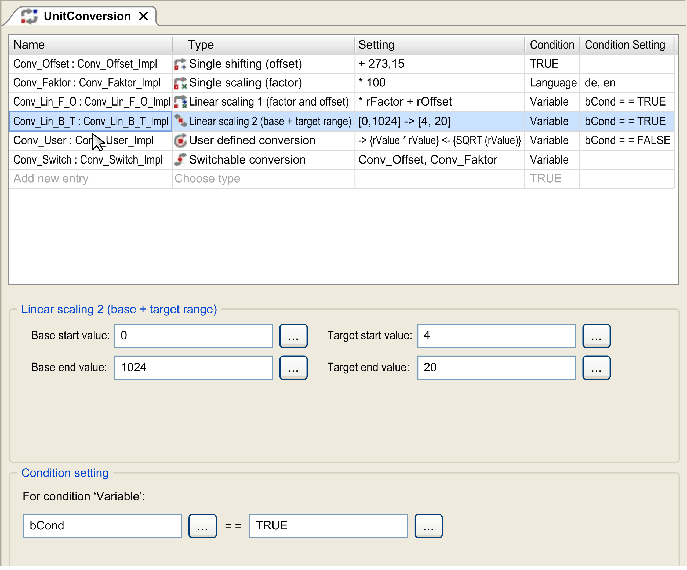

# Unit Conversion Configuration

## Overview

In the configuration editor UnitConversion, you define conversions which can be used for variables in visualization elements and in the IEC editors. Add the editor as an object UnitConversion in the Applications tree. You can rename it there.

UnitConversion editor



You can define various conversions for your project. Enter a Name and choose the Type for each. The respective conversion formula is automatically displayed in the Setting column. Enter a Condition to determine when the conversion should be executed. Depending on the selected Type, define specific parameters in the area below the table.

The editor provides the following conversion types:

* Calculation with an offset: [**Single shifting (offset)**](#D-SE-0083583__D-SE-0083583.4)
* Calculation with a factor: [**Single scaling (factor)**](#D-SE-0083583__D-SE-0083583.5)
* Calculation with a factor and an offset: [**Linear scaling 1 (factor and offset)**](#D-SE-0083583__D-SE-0083583.6)
* Calculation with the base range and target range: [**Linear scaling 2 (base and target range)**](#D-SE-0083583__D-SE-0083583.7)
* Calculation with a user-defined expression: [**User-defined conversion**](#D-SE-0083583__D-SE-0083583.9)
* Different calculations depending on a variable value: [**Switchable conversion**](#D-SE-0083583__D-SE-0083583.10)

For usage of unit conversions in IEC editors, refer to the chapter [*Usage in IEC Editors*](D-SE-0083584.html#D-SE-0083584).

For usage of unit conversions in visualizations, refer to the chapter *Using Unit Conversion* in the *Visualization* part of the online help.

## Conditions

You can select 3 conditions to define when the calculation is executed:

| Condition | Description |
| --- | --- |
| TRUE | The conversion is always performed. |
| Language | Language of the visualization (value of variable VisuElems.CurrentLanguage) |
| Variable | The conversion is performed depending on a variable value. The compare value can be a constant, a variable or an IEC expression. |

## Single Shifting (Offset)

Use this conversion if you want to add an offset to the input value.

(output value = input value + offset)

| Parameter | Description |
| --- | --- |
| Offset | Value or variable |

## Single Scaling (Factor)

Use this conversion if you want to multiply the input value by a factor.

(output value = input value \* factor)

| Parameter | Description |
| --- | --- |
| Factor | Value or variable |

## Linear Scaling 1 (Factor and Offset)

Use this conversion if you want to multiply the input value by a factor and to add an offset.

(output value = (input value \* factor) + offset)

| Parameter | Description |
| --- | --- |
| Factor | Value or variable |
| Offset | Value or variable |

## Linear Scaling 2 (Base and Target Range)

Use this conversion if you want to calculate the value by defining the input and output range. A factor and an offset are calculated internally.

| Parameter | Description |
| --- | --- |
| Base start value | Lower value of the input range |
| Base end value | Upper value of the input range |
| Target start value | Lower value of the output range |
| Target end value | Upper value of the output range |

Example

```
Base start value: 0
Base end value: 1024
Target start value: 4.0
Target end value: 20.0
```

## User-Defined Conversion

Use this conversion if you want to calculate the input value by a user-defined expression. Use the variable rValue as input value. In this expression, all IEC operands can be used.

| Parameter | Description |
| --- | --- |
| Convert | Expression to convert the input value |
| Reverse | Expression to revert the calculated value |

## Switchable Conversion

Use this conversion if you want to use different conversions, depending on the language or a variable value. All defined conversions can be used.

EIO0000002854.09