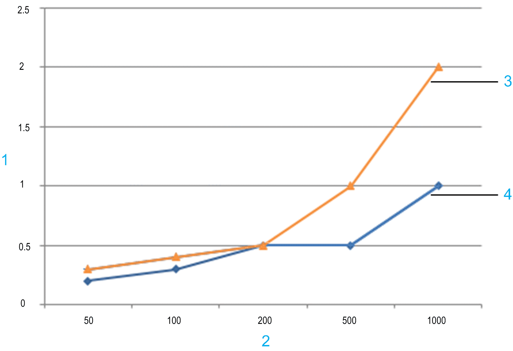

# Data Exchange Performance Between Controller and HMI Configured with Vijeo-Designer

## Overview

The communication speed between controller and HMI depends largely on the number of variables that are exchanged. Therefore, the time that is required to display the values on the HMI panels when a controller-HMI-connection is established, as well as to the refresh time of the variables, are affected accordingly.

This chapter provides reference values that have been achieved under optimum conditions. Actual values depend on the total performance of your controller application (for example, the communication task responsible for data exchange is executed with a low priority).

For data exchange using the Machine Expert protocol via Ethernet, this chapter indicates the number of variables allowed to achieve a good data transmission performance. If you are using serial line, consider to change to Ethernet for increasing the performance.

## General Measures for Improving Communication Performance

To improve the communication performance, you can take the following measures:

* In the equipment or scan group properties of your HMI, set the Vijeo-Designer parameter ScanRate to Fast.
* Reduce the number of variables per HMI panel because only the variables on the active panel are refreshed. It is a good practice to create several HMI panels with reduced number of variables in Vijeo-Designer instead of creating one HMI panel that shows many variables.
* Add only those variables to the Symbol configuration that are used in the HMI.

## Variable-to-Time Ratio for Refreshing Variables on the HMI Panel

The graph indicates reference values that have been measured for the time that is required to refresh variables over the Machine Expert protocol via Ethernet between XBTGT HMI and M••• controllers with different numbers of variables under non-industrial conditions.

Typical delay to refresh variables on the HMI:

**1** Time in seconds

**2** Number of variables

**3** XBTGT2330 + M••• controller

**4** XBTGT4330 + M••• controller

## Vijeo-Designer Suggestions on Variables

Vijeo-Designer provides the following suggested guidance for using variables in the Vijeo-Designer online help:

**Chapter** *Creating Variables → About Variables and Device Addresses → Source: Internal Versus External*:

* One target can have a maximum of 8000 or 12000 variables depending on the target type. Array and structure holders (the group node) also count as variables. A block variable counts as one variable.
* You can use a maximum of 800 variables on a single panel.

**Chapter** *Appendix → Run-Time Specifications*:

Number of variables per panel (limit):

| Controller | Maximum number of variables per panel |
| --- | --- |
| iPC series | 2500 |
| Other target types, except iPC | 800 |

Number of variables per target (limit):

| Controller | Maximum number of variables |
| --- | --- |
| * iPC\* * XBTGTW series | 12000 |
| * XBTGC * XBTGT * XBTGH * HMIGTO * HMISTO * HMISTU * HMISCU series | 8000 |
| XBTGK series | 8000 |
| | \* | For iPC: If persistent variables, such as alarm variables and data logging variables, are used, a maximum of 8000 variables can be supported for each iPC target. | | |

**Chapter** *Errors → Message List → Editor Error Messages→ 1300 - 1999→ Error 1301*:

Error 1301: [Target] [target name] too many variables. Variable limit is [8000 or 12000].

NOTE: The Vijeo-Designer online help indicates that the total number of elements in an array must not exceed 2048 (refer to the chapter *Creating Variables → Array Variables*). This limits the size of (single or multidimensional) array variables that are shared via the EcoStruxure Machine Expert Symbol Configuration. To overcome this limit, consider sharing an array of DUT (for example,  ARRAY[0..99] OF DUT\_30, where DUT\_30 is a user-defined type containing 30 distinct INT variables, resulting in 3000 variables). In any case, the Error 1301 will be issued if the maximum number of variables per target (8000 or 12000) is exceeded.

EIO0000002854.09