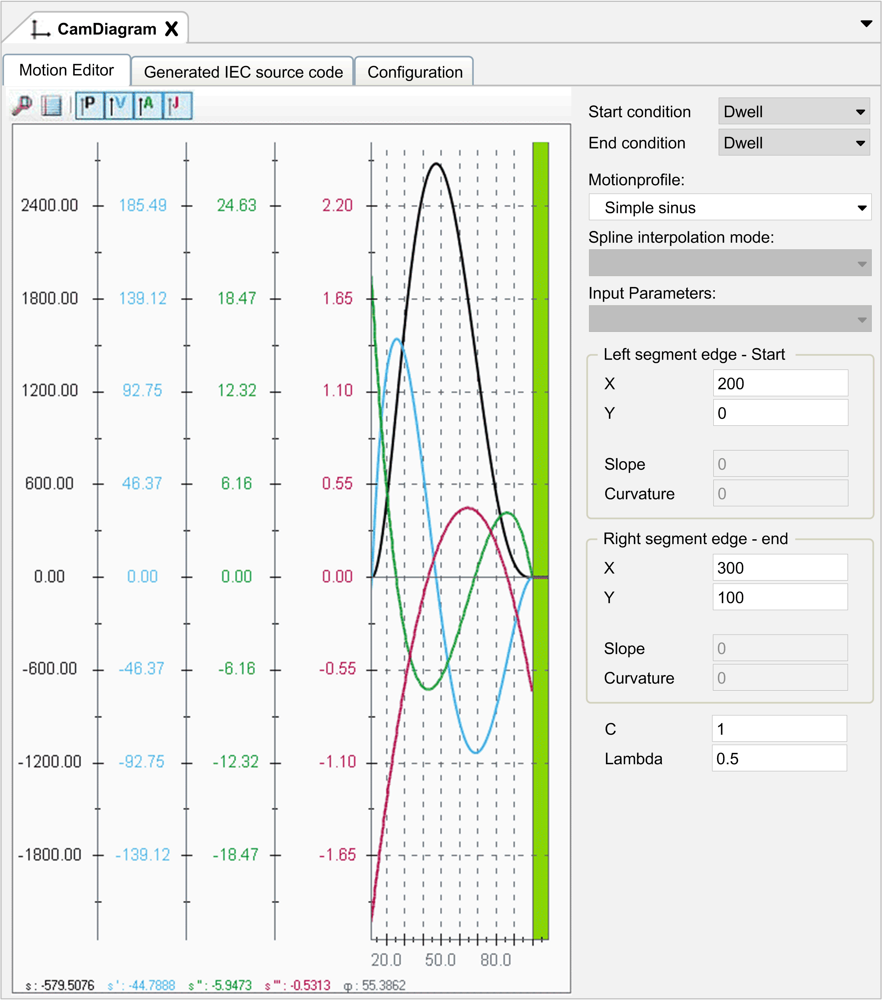

# Motion Editor

## Motion Editor Tab

The graphic displays the Motion Editor tab.

| Element | Description | Value range |
| --- | --- | --- |
| Cam diagram | The view on the left-hand side of this tab displays the individual segments of the cam diagram that have been double-clicked in the Tools tree.  The selected cam segment is highlighted green. To select a cam segment, double-click the segment in the Tools tree view or click the segment in the Motion Editor tab. | – |
| Start condition | The condition that applies at the start point of the selected cam segment. | * Dwell * Velocity * Return * Motion |
| End condition | The condition that applies at the end point of the selected cam segment. | * Dwell * Velocity * Return * Motion |
| Motionprofile | The motion law describes the profile of the segment. The available motion profile depends on the Start condition and End condition selected. Refer to the table [*Motion Profiles Available for Combinations of Start and End Conditions*](#D-SE-0062374__D-SE-0062374.3). | * Straight line * Quadratic parabola * Polynomial of 5th degree * Simple sinus * Modified sinus * Modified acceleration trapezoid * General polynomial of the 5th degree * Sinus-straight line combination * Sloped sinus * Modified sinus combination * Modified acceleration trapezoid combination * User-defined motion profiles |
| Spline interpolation mode | This parameter is only available for user-defined motion profiles. It defines how the edge condition at the start point and end point of the profile is resolved. | * Natural spline * Spline on base of the slope of the borders * Periodic spline |
| Input parameters | Select from the list the parameters which you will configure. **Result**: The corresponding text fields will become editable. The remaining parameter will be calculated by EcoStruxure Machine Expert. | The values listed in the table depend on the Motionprofile you selected. Refer to the following tables that list the parameters that are available per motion law. |
| Left segment edge - Start section | | |
| X | The x coordinate of the start point of the selected cam segment.  Represents the angle of the virtual line shaft where the segment starts. | Decimal number  Unit: φ |
| Y | The y coordinate of the start point of the selected cam segment.  Represents the position of the axis at the segment start. This is the value of s at the position x. | Decimal number  Unit: Position |
| Slope | The slope of the position curve at the start point of the selected cam segment. This is the value of s’. | Decimal number  Unit: Position / φ |
| Curvature | The curvature of the position curve at the start point of the selected cam segment. This is the value of s’’. | Decimal number  Unit: Position / φ2 |
| Right segment edge - end section | | |
| X | The x coordinate of the end point of the selected cam segment.  Represents the angle of the virtual line shaft where the segment ends. | Decimal number  Unit: φ |
| Y | The y coordinate of the end point of the selected cam segment.  Represents the position of the axis at the segment end. This is the value of s at the position x. | Decimal number  Unit: Position |
| Slope | The slope of the position curve at the end point of the selected cam segment. This is the value of s’. | Decimal number  Unit: Position / φ |
| Curvature | The curvature of the position curve at the end point of the selected cam segment. This is the value of s’’. | Decimal number  Unit: Position / φ2 |
| C | Defines the fraction of the selected cam segment that is spent for changing the velocity.  The value 1 indicates that there is no constant velocity phase within the segment. Acceleration and deceleration procedures are performed throughout the segment.  The value 0.5, for example, indicates that acceleration and deceleration procedures are performed during the half of the segment time. The other half of the segment, the inflexion point between acceleration and deceleration, is reserved for constant velocity. | 0...1 |
| Lambda | Defines the position of the inflexion point (when C=1) or of the phase within constant velocity (when C<1) on the x axis (φ) within the selected cam segment.  Lambda describes the proportion between acceleration and deceleration on the virtual line shaft angle within the segment.  In a segment that only consists of an acceleration phase (Start condition = Dwell, End condition = Velocity, the Lambda value is fixed to 1. Therefore, 100% of the time of changing the velocity is used for acceleration, 0% is used for deceleration.  In a segment that only consists of a deceleration phase (Start condition = Velocity, End condition = Dwell, the Lambda value is fixed to 0. Therefore, 0% of the time of changing the velocity is used for acceleration, 100% is used for deceleration.  In a segment that only consists of acceleration and deceleration phases (Start condition = Dwell, End condition = Dwell, the Lambda value is greater than 0 and less than 1. A value of 0.5 means that acceleration and deceleration phases have the same length on the x axis (φ). 50% of the total length is spent with changing the velocity. A value of 0.1 means that 10% of the acceleration and deceleration length on the x axis (φ) are used for deceleration. 90% are used for acceleration. | 0...1 |

Additional information for certain motion laws:

| Designation | Description |
| --- | --- |
| C | Cam percentage of a motion curve.  Valid interval: The value of the input field must be greater than 0 and less than or equal to 1.  Examples:  C = 1: The course is bent or a cam.  C = 0.001: The course almost matches a straight line completely.  C = 0.4: The course has a straight line percentage of 60% and a cam percentage of 40%. |
| Lambda | Position of the inflexion point.  For dwell/dwell laws the inflexion point is within the valid interval: The value of the input field must be greater than or equal to 0 and less than or equal to 1.  For Lambda = 0.5, the inflexion point is precisely in the center of the cam segment.  For Lambda = 0.00001, the inflexion point is almost at the left edge.  For the most dwell/velocity or velocity/dwell motion laws, Lambda is exactly 1 or 0 and is precisely at the left or right edge. |

## Motion Profiles Available for Combinations of Start and End Conditions

Depending on the combination of the boundary conditions (start condition, end condition) you can select the following Motionprofiles.

| From/to | Dwell  (v=0, a=0) | Velocity  (v<>0, a=0) | Return  (v=0, a<>0) | Motion  (v<>0, a<>0) |
| --- | --- | --- | --- | --- |
| Dwell  (v=0, a=0) | Straight line  Quadratic parabola  Polynomial of 5th degree  Simple sinus  Modified sinus  Sloped sinus  Modified acceleration trapezoid  General polynomial of the 5th degree | Quadratic parabola  Polynomial of 5th degree  Simple sinus  Modified sinus  Modified sinus combination  Modified acceleration trapezoid  General polynomial of the 5th degree  (Lambda = 1) | General polynomial of the 5th degree  Modified acceleration trapezoid combination | General polynomial of the 5th degree |
| Velocity  (v<>0, a=0) | Quadratic parabola  Polynomial of 5th degree  Simple sinus  Modified sinus  Modified sinus combination  Modified acceleration trapezoid  General polynomial of the 5th degree  (Lambda = 0) | Straight line  General polynomial of the 5th degree  Modified sinus combination | General polynomial of the 5th degree | General polynomial of the 5th degree |
| Return  (v=0, a<>0) | Modified acceleration trapezoid combination |  | Sinus straight combination  General polynomial of the 5th degree | General polynomial of the 5th degree |
| General polynomial of the 5th degree | |
| Motion  (v<>0, a<>0) | General polynomial of the 5th degree | | | |

## Parameters for Motion Laws Quadratic parabola, Polynomial of 5th degree, Simple sinus, Modified sinus, Modified acceleration trapezoid

The table lists the parameters that are available for the motion laws Quadratic parabola, Polynomial of 5th degree, Simple sinus, Modified sinus, Modified acceleration trapezoid, and the values they can have in accordance with the selected Start condition and End condition:

| Parameter | Start condition - End condition | | |
| --- | --- | --- | --- |
| Dwell - Dwell | Dwell - Velocity | Velocity - Dwell |
| X start | User input | User input | User input |
| Y start | User input | User input\* or calculated by EcoStruxure Machine Expert | User input\* or calculated by EcoStruxure Machine Expert |
| Slope start | Fixed to 0 | Fixed to 0 | User input\* or calculated by EcoStruxure Machine Expert |
| Curvature start | Fixed to 0 | Fixed to 0 | Fixed to 0 |
| X end | User input | User input | User input |
| Y end | User input | User input\* or calculated by EcoStruxure Machine Expert | User input\* or calculated by EcoStruxure Machine Expert. |
| Slope end | Fixed to 0 | User input\* or calculated by EcoStruxure Machine Expert. | Fixed to 0 |
| Curvature end | Fixed to 0 | Fixed to 0 | Fixed to 0 |
| C | User input(0...1) | User input\* (0...1) or calculated by EcoStruxure Machine Expert. | User input\* (0...1) or calculated by EcoStruxure Machine Expert. |
| Lambda | User input(0...1) | Fixed to 1 | Fixed to 0 |
| \* By default, one out of four parameters is calculated by EcoStruxure Machine Expert, whereas the other three parameters are editable. You can change this by clicking the option next to the parameter. | | | |

## Parameters for Motion Law Sloped sinus

The table lists the parameters that are available for the motion law Sloped sinus and the values they can have in accordance with the selected Start condition and End condition:

| Parameter | Start condition - End condition |
| --- | --- |
| Dwell - Dwell |
| X start | User input |
| Y start | User input |
| Slope start | Fixed to 0 |
| Curvature start | Fixed to 0 |
| X end | User input |
| Y end | User input |
| Slope end | Fixed to 0 |
| Curvature end | Fixed to 0 |
| C | User input(0...1) |
| Lambda | User input(0...1) |

## Parameters for Motion Law Modified sinus combination

The table lists the parameters that are available for the motion law Modified sinus combination and the values they can have in accordance with the selected Start condition and End condition:

| Parameter | Start condition - End condition | | |
| --- | --- | --- | --- |
| Velocity - Velocity | Dwell - Velocity | Velocity - Dwell |
| X start | User input | User input | User input |
| Y start | User input | User input | User input |
| Slope start | User input | Fixed to 0 | User input |
| Curvature start | Fixed to 0 | Fixed to 0 | Fixed to 0 |
| X end | User input | User input | User input |
| Y end | User input | User input | User input |
| Slope end | User input | User input | Fixed to 0 |
| Curvature end | Fixed to 0 | Fixed to 0 | Fixed to 0 |
| Lambda | User input(0...1) | User input(0...1) | User input(0...1) |

## Parameters for Motion Law Straight line

The table lists the parameters that are available for the motion law Straight line and the values they can have in accordance with the selected Start condition and End condition:

| Parameter | Start condition - End condition | |
| --- | --- | --- |
| Dwell - Dwell | Velocity - Velocity |
| X start | User input | User input |
| Y start | User input | User input\* or calculated by EcoStruxure Machine Expert |
| Slope start | Fixed to 0 | User input or calculated\* by EcoStruxure Machine Expert |
| Curvature start | Fixed to 0 | Fixed to 0 |
| X end | User input | User input |
| Y end | User input | User input\* or calculated by EcoStruxure Machine Expert |
| Slope end | Fixed to 0 | The same value is used as for the parameter Slope start. |
| Curvature end | Fixed to 0 | Fixed to 0 |
| \* By default, the Slope start parameter is calculated by EcoStruxure Machine Expert, whereas the parameters Y start and Y end are editable.You can change this by clicking the option next to the parameter. | | |

## Parameters for Motion Law Sinus-straight line combination

The motion law Sinus-straight line combination is only available for Start condition > Return and End condition > Return. The table lists the available parameters:

| Parameter | Start condition - End condition |
| --- | --- |
| Return - Return |
| X start | User input |
| Y start | User input |
| Slope start | User input\* or calculated by EcoStruxure Machine Expert |
| Curvature start | User input\* or calculated by EcoStruxure Machine Expert |
| X end | User input |
| Y end | User input |
| Slope end | User input\* or calculated by EcoStruxure Machine Expert |
| Curvature end | User input\* or calculated by EcoStruxure Machine Expert |
| C | User input\* or calculated by EcoStruxure Machine Expert |
| Lambda | User input\* or calculated by EcoStruxure Machine Expert |
| \* Use the Input parameters list to select two out of six parameters as editable. The remaining four parameters are calculated by EcoStruxure Machine Expert. | |

## Parameters for Motion Law General polynomial of the 5th degree

Since the motion law General polynomial of the 5th degree is available for 15 combinations of Start condition - End condition values, 4 different parameter tables are provided for this motion law.

The table lists the parameters that are available for the motion law General polynomial of the 5th degree and the values they can have in accordance with the selected Start condition=Dwell together with several End condition values:

| Parameter | Start condition - End condition | | | |
| --- | --- | --- | --- | --- |
| Dwell - Dwell | Dwell - Velocity | Dwell - Motion | Dwell - Return |
| X start | User input | User input | User input | User input |
| Y start | User input | User input | User input | User input |
| Slope start | Fixed to 0 | Fixed to 0 | Fixed to 0 | Fixed to 0 |
| Curvature start | Fixed to 0 | Fixed to 0 | Fixed to 0 | Fixed to 0 |
| X end | User input | User input | User input | User input |
| Y end | User input | User input | User input | User input |
| Slope end | Fixed to 0 | User input | User input | Fixed to 0 |
| Curvature end | Fixed to 0 | Fixed to 0 | User input | User input |

The table lists the parameters that are available for the motion law General polynomial of the 5th degree and the values they can have in accordance with the selected Start condition=Motion together with several End condition values:

| Parameter | Start condition - End condition | | | |
| --- | --- | --- | --- | --- |
| Motion - Dwell | Motion - Motion | Motion - Return | Motion - Velocity |
| X start | User input | User input | User input | User input |
| Y start | User input | User input | User input | User input |
| Slope start | User input | User input | User input | User input |
| Curvature start | User input | User input | User input | User input |
| X end | User input | User input | User input | User input |
| Y end | User input | User input | User input | User input |
| Slope end | Fixed to 0 | User input | Fixed to 0 | User input |
| Curvature end | Fixed to 0 | User input | User input | Fixed to 0 |

The table lists the parameters that are available for the motion law General polynomial of the 5th degree and the values they can have in accordance with the selected Start condition=Return together with several End condition values:

| Parameter | Start condition - End condition | | | |
| --- | --- | --- | --- | --- |
| Return - Dwell | Return - Motion | Return - Return | Return - Velocity |
| X start | User input | User input | User input | User input |
| Y start | User input | User input | User input | User input |
| Slope start | Fixed to 0 | Fixed to 0 | Fixed to 0 | Fixed to 0 |
| Curvature start | User input | User input | User input | User input |
| X end | User input | User input | User input | User input |
| Y end | User input | User input | User input | User input |
| Slope end | Fixed to 0 | User input | Fixed to 0 | User input |
| Curvature end | Fixed to 0 | User input | User input | Fixed to 0 |

The table lists the parameters that are available for the motion law General polynomial of the 5th degree and the values they can have in accordance with the selected Start condition=Velocity together with several End condition values:

| Parameter | Start condition - End condition | | | |
| --- | --- | --- | --- | --- |
| Velocity - Dwell | Velocity - Motion | Velocity - Return | Velocity - Velocity |
| X start | User input | User input | User input | User input |
| Y start | User input | User input | User input | User input |
| Slope start | User input | User input | User input | User input |
| Curvature start | Fixed to 0 | Fixed to 0 | Fixed to 0 | Fixed to 0 |
| X end | User input | User input | User input | User input |
| Y end | User input | User input | User input | User input |
| Slope end | Fixed to 0 | User input | Fixed to 0 | User input |
| Curvature end | Fixed to 0 | User input | User input | Fixed to 0 |

## Parameters for Motion Law Modified acceleration trapezoid combination

The table lists the parameters that are available for the motion law Modified acceleration trapezoid combination and the values they can have in accordance with the selected Start condition and End condition:

| Parameter | Start condition - End condition | |
| --- | --- | --- |
| Return - Dwell | Dwell - Return |
| X start | User input | User input |
| Y start | User input | User input |
| Slope start | Fixed to 0 | Fixed to 0 |
| Curvature start | User input | Fixed to 0 |
| X end | User input | User input |
| Y end | User input | User input |
| Slope end | Fixed to 0 | Fixed to 0 |
| Curvature end | Fixed to 0 | User input |

EIO0000002854.09