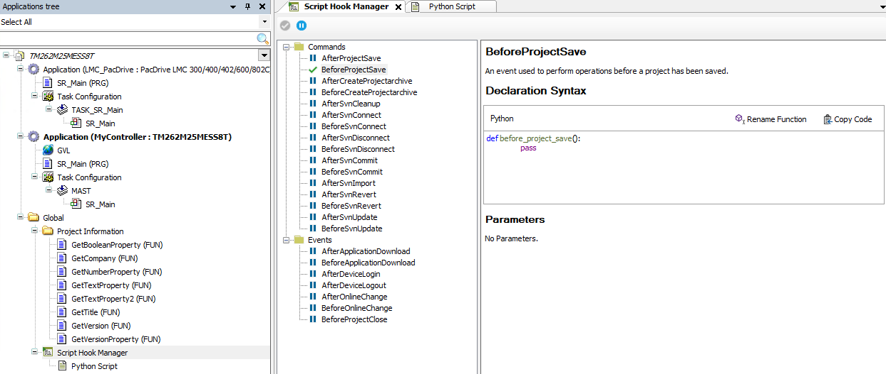

# Script Hook Manager

## Overview

The Script Hook Manager provides an interface to several commands and events that can be executed while running EcoStruxure Machine Expert. The execution of the command or detection of the event can trigger the execution of a specific Python script. You can program your own Python script or you can use one of the Python templates that is delivered with EcoStruxure Machine Expert.

NOTE: EcoStruxure Machine Expert supports different events. Events that are not supported by the programming software you are using are marked in the [Script Hook Manager editor](#D-SE-0107437__D-SE-0107437.14).

The *AutomaticProjectArchiveCreation.py* template, for example, provides a Python script for creating a project archive. If different users are working on the same project, this helps to ensure that a project archive is created whenever the project has been changed by whichever person. Thus, each user is supplied with the latest state of the project if the latest project archive is used.

For further information, refer to the following *Script Engine User Guides* provided in the *Software - Programming* part of the online help:

* CODESYS Script Engine - User Guide
* Schneider Electric Script Engine - User Guide

## Creating a Script Hook Manager Object

To create a Script Hook Manager object, proceed as follows:

| Step | Action | Comment |
| --- | --- | --- |
| 1 | Right-click the Global node of the Applications tree and execute the command Add Object > Script Hook Manager. | **Result**: The Add Script Hook Manager dialog box opens. |
| 2 | Select the suitable option for creating a Python script. | * Select the New Script option to create a new Python script from scratch in Logic Builder. * Select the From Template option and select a Python template that is delivered with EcoStruxure Machine Expert as a basis for creating your Python script. The use cases that are covered by the different templates are described by the comments in the scripts themselves. * Select the From Existing Script option to open a Python script file that you programmed in another tool. Click the Select button to open a File open dialog box to browse for the *.py* file. |
| 3 | Click the Add button. | **Results**:   * A Script Hook Manager node and a Python Script node are added as subnodes of the Global node of the Applications tree. * The Script Hook Manager editor opens. |

## Script Hook Manager Editor

The Script Hook Manager editor lists the Commands and Events that are available for triggering the execution of Python scripts on the left-hand side.

* To activate a command or event, select the respective item, and click the Enable Hook button .
* To deactivate a command or event, select the respective item, and click the Disable Hook button .

These status settings are saved to the project. For example, if you open a project that was previously saved with a BeforeProjectSave hook enabled, this hook remains active and is triggered as soon as the event / command becomes valid.

NOTE: EcoStruxure Machine Expert supports different events. Events that are not supported by the programming software you are using are marked in the Script Hook Manager editor . When you attempt to execute an unsupported event, a message is displayed in the Messages [view](../../../../../api/crossBook?lang=en-US&virtualBookName=SoMMenu&topicID=D_SE_0083922) and the code will not be executed.

On the right-hand side, further information is presented for the selected command or event:



The Declaration Syntax section provides the signature of the method that is called by the system after the event or command has been executed by EcoStruxure Machine Expert. Click the Copy Code button to insert the code into your Python code in the Python Script editor and extend this method by the Python commands you want to execute.

The Rename Function button allows you to modify the name of the Python function in a separate dialog box. After you have saved a different name, make sure that you use the exact string of the modified name in your Python code.

The Parameters section lists the parameters that are available inside the Python method when it is executed.

## Python Script Editor

The Python Script editor allows you to program your Python script directly in Logic Builder. The editor supports all Python programming features, even though the Autocomplete (IntelliSense) function does not provide all available Python keywords for selection.

According to the selection you made in the Add Script Hook Manager dialog box, you have the following options for creating your Python script in the Python Script editor:

* From scratch, starting with an empty Python Script editor, by entering your code and using the code snippets you copy from the Declaration Syntax section of the Script Hook Manager editor.
* From template, by using the script provided by the selected template as a basis and extending it by your specific Python code.
* By importing the Python script you programmed in another tool.

NOTE: After you have programmed your Python script, click the Update Script Scope  button to synchronize the script and to apply the modifications. If you exit the Python Script editor without synchronization, modifications are saved and are thus still available in the editor but they are not applied. The previous script without modification is still executed instead. If you load another project or create a new project, a different script - or no script at all - will be available.

With the Update Script Scope procedure, the Python code is validated. If errors are detected, they are indicated in the Messages [view](../../../../../api/crossBook?lang=en-US&virtualBookName=SoMMenu&topicID=D_SE_0083922) and the code will not be executed.

**Ignoring Multiple Events During Login/Logout**

NOTE: Due to technical limitations the AfterDeviceLogin and/or the AfterDeviceLogout event can be triggered several times.

For example, ignore the multiple execution of the AfterDeviceLogin event with the help of a flag in the script:

```
def after_device_login():
    if session_store.get("loginHandled", False) == False:
        print("after_device_login")
        session_store.set("loginHandled", True)
    pass

def after_device_logout():
    print("after_device_logout")
    session_store.set("loginHandled", False)
    pass
```

## Script Hook Messages in the Messages View

The texts you program in your Python code with the `print` command are displayed in the Scripthooks area of the Messages [view](../../../../../api/crossBook?lang=en-US&virtualBookName=SoMMenu&topicID=D_SE_0083922).

EIO0000002854.09