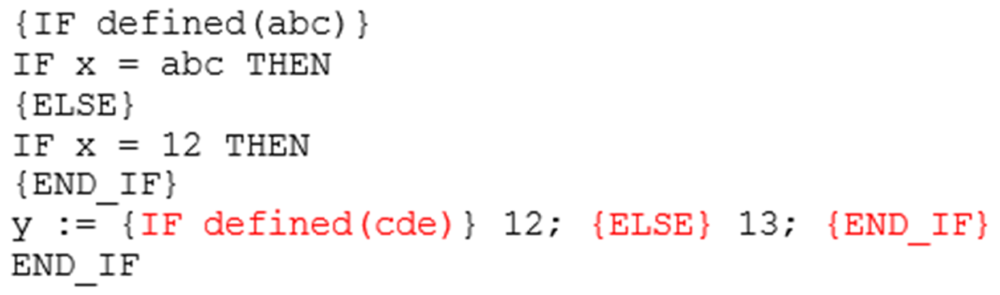

# Pragma Instructions

## Overview

A pragma instruction is used to affect the properties of one or several variables concerning the compilation or precompilation (preprocessor) process. Therefore, a pragma influences the code generation.

NOTE: Consider that the available pragmas are not 1:1 implementations of C preprocessor directives. They are handled as normal statements and therefore can only be used at statement positions. They must not be used within an expression and not in the declaration part of editors.

A pragma can determine whether a variable will be initialized, monitored, added to a parameter list, added to the [symbol list](D-SE-0083654.html#D-SE-0083654), or made invisible in the Library Manager. It can force message outputs during the build process. You can use conditional pragmas to define how the variable should be treated depending on certain conditions. You can also enter these pragmas as definitions in the compile properties of a particular object.

You can use a pragma in a separate line, or with supplementary text in an implementation or declaration editor line. Within the FBD/LD/IL editor, execute the command Insert Label and replace the default text `Label:` in the arising text field by the pragma. In case you want to set a label as well as a pragma, insert the pragma first and the label afterwards.

The pragma instruction is enclosed in curly brackets.

## Syntax

{ <instruction text> }

The opening bracket can immediately come after a variable name. Opening and closing brackets have to be in the same line.

## Correct Positions for a Conditional Pragma

```
{IF defined(abc)}
IF x =abc THEN
  {IF defined(cde)}
    y := 12;
  {ELSE}
    y :=13;
  {END_IF}
END_IF
{ELSE}
IF x = 12 THEN
  {IF defined(cde)}
    y := 12;
  {ELSE}
    y :=13;
  {END_IF}
END_IF
```

## Incorrect Positions for a Conditional Pragma

NOTE: Do **not** use conditional pragmas at positions indicated in this “bad practice” example.



## Further Information

Depending on the type and contents of a pragma, the pragma operates on the subsequent statement, respectively all subsequent statements, until one of the following conditions is met:

* It is ended by an appropriate pragma.
* The same pragma is executed with different parameters.
* The end of the code is reached.

The term code in this context refers to a declaration part, implementation part, global variable list, or type declaration.

NOTE: Pragma instructions are case-sensitive.

If the compiler cannot meaningfully interpret the instruction text, the entire pragma is handled as a comment and is skipped.

Refer to the following pragma types:

* [*Message Pragmas*](D-SE-0083615.html#D-SE-0083615)
* [*Attribute Obsolete*](D-SE-0083649.html#D-SE-0083649)
* [*Attribute Pragmas*](D-SE-0083619.html#D-SE-0083619)
* [*Conditional Pragmas*](D-SE-0083616.html#D-SE-0083616)
* [*Region Pragmas*](D-SE-0083617.html#D-SE-0083617)
* [*Attribute Symbol*](D-SE-0083654.html#D-SE-0083654)

EIO0000002854.09