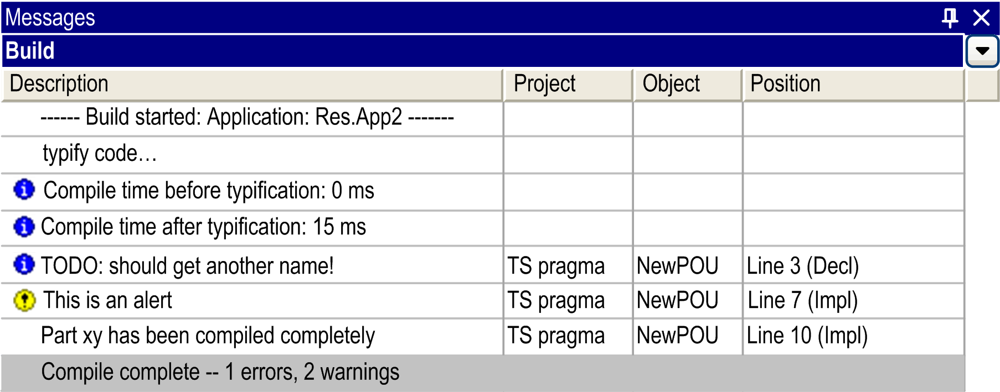

# Message Pragmas

## Overview

You can use message pragmas to force the output of messages in the Messages view (by default in the Edit menu) during the compilation (build) of the project.

You can insert the pragma instruction in an existing line or in a separate line in the text editor of a POU. Message pragmas positioned within currently not defined sections of the implementation code will not be considered when the project is compiled. For further information, refer to the example provided with the description of the defined (identifier) in the chapter [*Conditional Pragmas*](D-SE-0083616.html#D-SE-0083616).

## Types of Message Pragmas

There are 4 types of message pragmas:

| Pragma | Icon | Message Type |
| --- | --- | --- |
| ``` {text 'text string'} ``` | – | text type  The specified text string will be displayed. |
| ``` {info 'text string'} ``` |  | information  The specified text string will be displayed. |
| ``` {warning digit 'text string'} ``` |  | alert type  The specified text string will be displayed.  In contrast to the global [obsolete pragma](D-SE-0083649.html#D-SE-0083649), this alert is explicitly defined for the local position.  NOTE: The alert pragma `{warning digit 'text string'}` is exclusive to objects such as POUs, to statements and to variables. |
| ``` {error 'text string'} ``` |  | error type  The specified text string will be displayed. |

NOTE: For messages of types information, alert, and detected error, you can reach the source position of the message - that is where the pragma is placed in a POU - by executing the command Next Message. This is not possible for the text type.

## Example of Declaration and Implementation in ST Editor

```
VAR
ivar : INT; {info 'TODO: should get another name'}
bvar : BOOL;
arrTest : ARRAY [0..10] OF INT;
i:INT;
END_VAR
arrTest[i] := arrTest[i]+1;
ivar:=ivar+1;
{warning 'This is an alert'}
{text 'Part xy has been compiled completely'}
```

Output in Messages view:



EIO0000002854.09