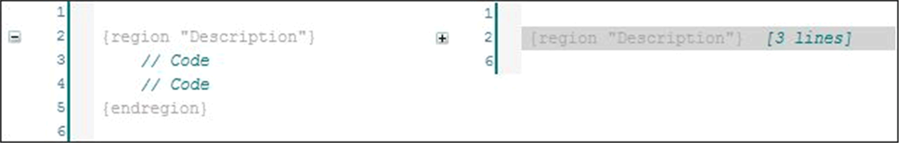

# Region Pragmas

## Overview

Use region pragmas to group several lines into one block in a text editor. You can assign a name to the block. Region pragmas can be nested.

The figure shows a program code that contains a region pragma in the extended and in the collapsed view.

Region pragmas can be used in the ST editor and in the declaration editors.

EIO0000002854.09