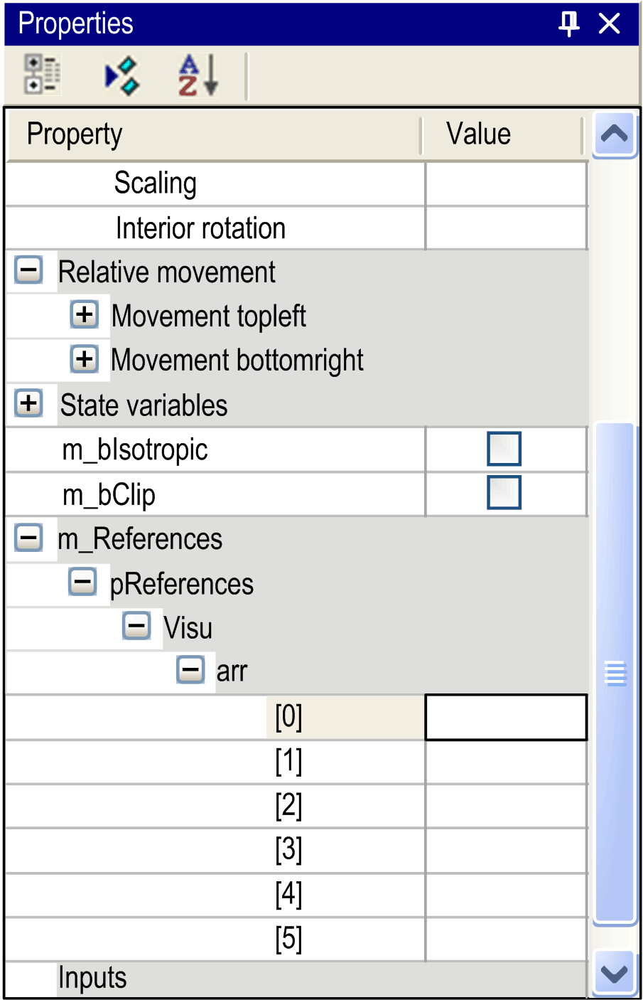

# `Attribute ExpandFully`

## Overview

Use the pragma `{attribute 'ExpandFully'}` to make all members of arrays used as input variables for referenced visualizations accessible within the Visualization Properties dialog box.

## Syntax

{attribute 'ExpandFully'}

## Example

Visualization visu is intended to be inserted in a frame within visualization visu\_main.

As input variable arr is defined in the interface editor of visu and will later be available for assignments in the Properties dialog box of the frame in `visu_main`.

In order to get the available particular components of the array in the Properties dialog box, insert the attribute ExpandFully in the interface editor of visu directly before arr.

Declaration in the interface editor of visu:

```
VAR_INPUT
{attribute 'ExpandFully'}
arr : ARRAY[0..5] OF INT;
END_VAR
```

Resulting Properties dialog box of frame in `visu_main`:



EIO0000002854.09