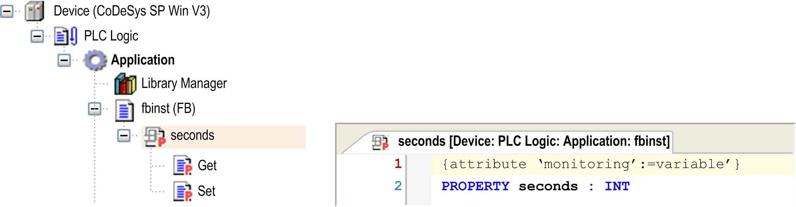
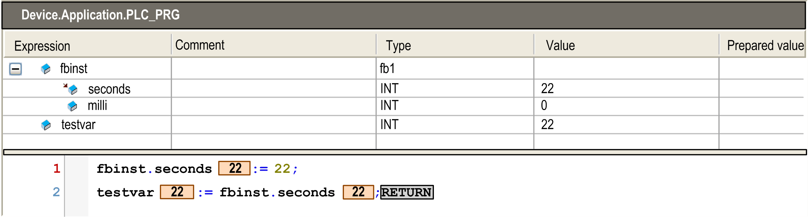
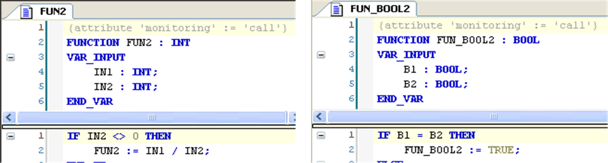
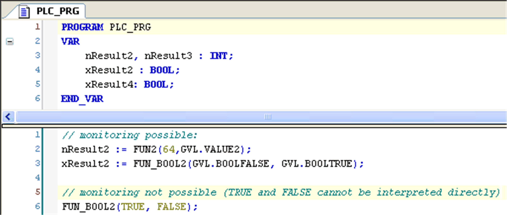
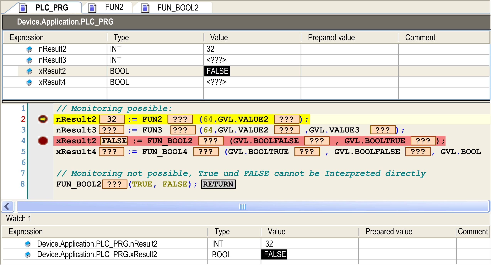

# `Attribute monitoring`

## Overview

This attribute pragma allows you to get properties and function call results monitored in the online view of the IEC editor or in a watch list.

## Monitoring of Properties

Add the pragma in the line above the property definition. Then the name, type, and value of the variables of the property will be displayed in the online view of the POU using the property or in a watch list. Therein, you can also enter prepared values to force variables belonging to the property.

Example of property prepared for variable monitoring

Example of monitoring view

## Monitoring the Current Value of the Property Variables

There are two different ways to monitor the current value of the property variables. For the particular use case, consider carefully which attribute is suitable to actually get the desired value. This will depend on whether operations on the variables are implemented within the property:

**1. Pragma** {attribute 'monitoring':='variable'}

An implicit variable is created for the property, which will get the current property value whenever the application calls the set or get method. The latest value stored in this implicit variable will be monitored.

**Syntax**

{attribute 'monitoring':='variable'}

**2. Pragma** {attribute 'monitoring':='call'}

You can only use this attribute for properties returning simple data types or pointers, not for structured types.

The value to be monitored is read or written by a direct call of property: the monitoring service of the runtime system executes the `Get` or `Set` method of the property function including the implementation part of the property.

NOTE: When choosing this monitoring type instead of using an intermediate variable (see *1. Pragma*), consider possible side effects due to any operations implemented within the property.

NOTE: The monitoring pragma is also evaluated by the [symbol configuration](D-SE-0083586.html#D-SE-0083586__D-SE-0083586.3). If the value variable was specified, only a read-access on the property is available in the symbol configuration.

**Syntax**

{attribute 'monitoring':='call'}

## Monitoring of Function Call Results

You can use function call monitoring for any constant value that can be interpreted as 4 byte numerical value (for example, INT, SHORT, LONG). For the other input parameters (for example, BOOL), use a variable instead of a constant parameter. Add the pragma `{attribute 'monitoring':='call'}` in the line above the function declaration. You can then monitor this variable in the text editor view in online view of the POU in which a variable gets assigned the result of a function call. You can also add the variable to a watch list for the same purpose. To get the variable immediately provided within a watch view, execute the command Add watchlist.

Example 1: Functions `FUN2` and `FUN_BOOL2` with attribute `'monitoring'`

Example 2: Call of functions `FUN2` and `FUN_BOOL2` in a program POU

Example 3: Function calls in online mode:

## Monitoring of Variables with an Implicit Call of an External Function

For monitoring variables with an implicit call of an external function, the following conditions have to be fulfilled:

* The function is marked with `{attribute 'monitoring' := 'call'}`.
* The function is marked as Link Always.
* The variable is marked with `{attribute 'monitoring_instead' := 'MyExternalFunction(a,b,c)'}.`
* The values `a,b,c` are integer values and match the input parameters of the function to call.

NOTE: Forcing or writing of functions is not supported. You can implicitly implement forcing by adding an additional input parameter for the particular function that serves as an internal force flag.

NOTE: Function monitoring is not possible on the compact runtime system.

EIO0000002854.09