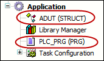
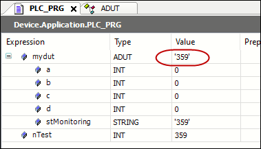

# `Attribute monitoring_display`

## Overview

Insert this attribute pragma in the declaration part of a function block or a structure to monitor the value of the specified member (property or variable) in the online view. The value is displayed in the first line of monitored variables of the respective function block or structure.

## Syntax

`{attribute 'monitoring_display' := '<component name>'}`

Insert the pragma as the first line of the declaration part of a function block or a structure.

## Example



```
{attribute 'monitoring_display' := 'stMonitoring'} 
TYPE ADUT :
STRUCT	
 val1: INT;	
 val2: INT;	
 stMonitoring: STRING := 'to be monitored';
END_STRUCT
END_TYPE

PROGRAM PLC_PRG
VAR	
 mydut: ADUT;
 nTest: INT;
END_VAR
nTest:= iCounter + 1;
mydut.stMonitoring := INT_TO_STRING(nTest);
```



EIO0000002854.09