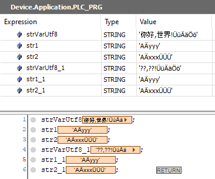

# `Attribute monitoring_encoding`

## Overview

Add the pragma `Attribute monitoring_encoding` to string variables and aliases. Values of variables marked with this pragma are decoded in [UTF-8 format](UTF-8Encoding-3F7F7388.html) during monitoring.

## Syntax

```
{attribute 'monitoring_encoding' := 'UTF8'}
```

## Example

Insert the pragma `Attribute monitoring_encoding` above the variable declaration.

```
PROGRAM PLC_PRG
VAR
    {attribute 'monitoring.encoding' := 'UTF8'}
    strDat : STRING := 'abc'; 
    attribute 'monitoring_encoding' := 'UTF-8'}	
    strVarUtf8: STRING := UTF8#'你好,世界!ÜüÄäÖö';
    {attribute 'monitoring_encoding' := 'UTF-8'}
    str1: STRING := UTF8#'AÄyyy';		
    {attribute 'monitoring_encoding' := 'UTF-8'}		
    str2: STRING := UTF8#'AÄxxxÜÜÜ';	
		
    strVarUtf8_1: STRING := '你好,世界!ÜüÄäÖö';
    str1_1: STRING := 'AÄyyy';				
    str2_1: STRING := 'AÄxxxÜÜÜ';			
END_VAR
```



EIO0000002854.09