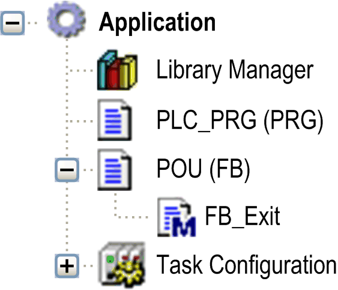

# `Attribute no-exit`

## Overview

If a function block provides an FB\_exit [method](D-SE-0083611.html#D-SE-0083611__D-SE-0083611.15) , you can suppress its call for a special instance with the help of assigning the pragma {attribute no-exit} to the function block instance.

## Syntax

{attribute 'no-exit'}

## Example

Assume the method FB\_Exit being added to a function block named POU:



In the main program PLC\_PRG, 2 variables of type POU are instantiated:

```
PROGRAM PLC_PRG
VAR
POU1 : POU;
{attribute 'no-exit'}
POU2 : POU;
END_VAR
```

When variable bInCopyCode becomes TRUE within POU1, the method FB\_Exit is called exiting an instance that will get copied afterwards (online change). The method FB\_Exit is not called in context of the function block instance POU2.

EIO0000002854.09