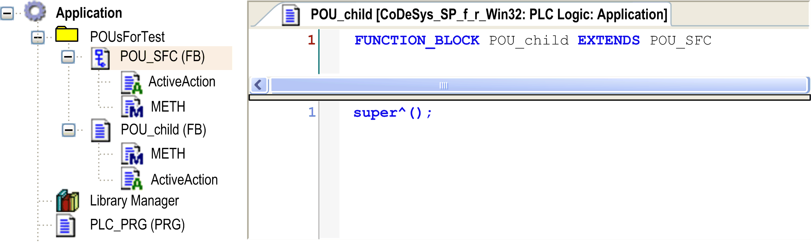
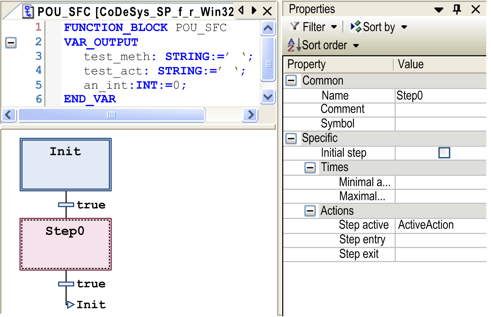
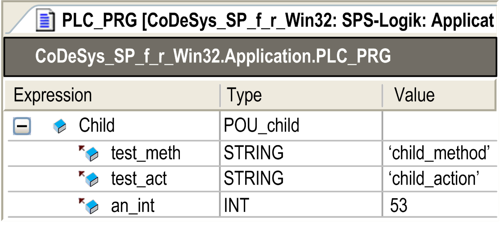
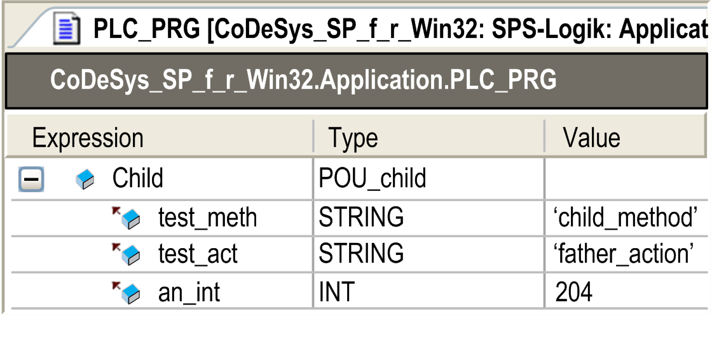

# `Attribute no_virtual_actions`

## Overview

This attribute is valid for function blocks, which are derived from a base function block implemented in SFC, and which are using the main SFC workflow of the base class. The actions called therein show the same virtual behavior as methods. Therefore, the base class actions may be overridden by specific implementations related to the derived classes.

In order to help to prevent the action of the base class from being overridden, you can assign the pragma `{attribute 'no_virtual_actions'}` to the base class.

## Syntax

{attribute 'no\_virtual\_actions'}

## Example

In the following example, the function block `POU_SFC` provides the base class to be extended by the function block `POU_child`.



By use of the keyword `SUPER`, the derived class `POU_child` calls the workflow of the base class that is implemented in SFC.



The exemplary implementation of this workflow is restricted to the initial step. This is followed by 1 single step with associated step action ActiveAction concerned with the assignment of the output variables:

```
an_int:=an_int+1;          // counting the action calls
test_act:='father_action'; // writing string variable test_act
METH();                   // Calling method METH for writing string variable test_meth
```

In case of the derived class `POU_child`, the step action will be overwritten by a specific implementation of ActiveAction. It differs from the original one by assigning the string `'child_action'` instead of `'father_action'` to variable `test_act`.

Likewise, the method `METH`, assigning the string `'father_method'` to variable `test_meth` within the base class, will be overwritten such that `test_meth` will be assigned to `'child_method'` instead.

The main program `PLC_PRG` will execute repeated calls to Child (an instance of `POU_child`). As expected, the actual value of the output string report the call to action and method of the derived class:



You can observe a different behavior if the base class is preceded by the attribute `'no_virtual_actions'`

```
{attribute 'no_virtual_actions'}
FUNCTION_BLOCK POU_SFC...
```

Whereas method `METH` will still be overwritten by its implementation within the derived class, a call of the step action will now result in a call of action ActiveAction of the base class. Therefore, `test_act` will be assigned to string `'father_action'`.



EIO0000002854.09