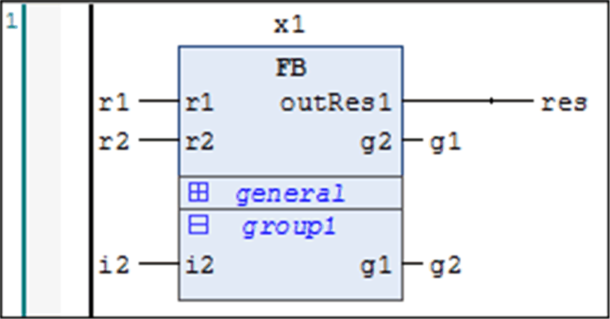

# `Attribute pingroup`

## Overview

Insert the pragma {attribute 'pingroup' := '<groupname>'} in the declaration of a function block, for grouping the input pins or output pins (parameters). Then, in the respective box of the FBD and LD editor, each pin group can be displayed, folded, or unfolded. Multiple groups are possible and are differentiated by their names. The particular state (folded/unfolded) per box is saved in the project options.

Inputs and outputs without attribute `pingroup` are always displayed above any possible group or groups.

## Syntax

```
{attribute 'pingroup' := '<groupname>'}
```

## Example

Two groups are defined:

* general `(i1, out1)`
* group1 `(i2, g1)`

`r1, r2, outRes1` and `g2` are always displayed.

```
FUNCTION_BLOCK FB
VAR_INPUT
   r1 : REAL;
   {attribute 'pingroup' := 'general'}
   i1 : INT;
   {attribute 'pingroup' := 'group1'}
   i2 : INT;
   r2 : REAL;
END_VAR
```

```
VAR_OUTPUT
   outRes1 : REAL;
   {attribute 'pingroup' := 'general'}
   out1 : INT;
   {attribute 'pingroup' := 'group1'}
   g1 : INT;
   g2 : REAL;
END_VAR
```

Pingroups in FBD editor



EIO0000002854.09