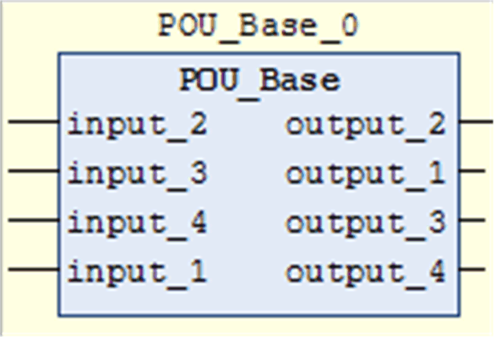

# `Attribute pin_presentation_order_inputs/outputs`

## Overview

The pragmas define the order in which the inputs and outputs of a function block are displayed in graphical language editors.

## Syntax

```
{attribute 'pin_presentation_order_inputs' :=
'<input_k>,<input_l>,*,<input_m>'}
```

```
{attribute 'pin_presentation_order_outputs' :=
'<output_k>,<output_l>,*,<output_m>'}
```

The `*` character is the separator between the beginning and the end of the sorted list of input or output parameters. The separator is replaced by undefined input or output parameters. If the separator is not available, then the input or output parameters that are not defined explicitly in the pragma will be added to the end of the sorted list.

The pragmas are inserted in the first line in the declaration part of a function block.

NOTE: The pragmas attribute 'pin\_presentation\_order\_inputs and attribute 'pin\_presentation\_order\_outputs are not evaluated when the pragma pingroup is used.

## Example

```
{attribute 'pin_presentation_order_inputs' :=
'input_2,*,input_1'}
{attribute 'pin_presentation_order_outputs' :=
'output_2, output_1}
FUNCTION_BLOCK POU_BASE
VAR_INPUT
    input_1 : BOOL;
    input_2 : INT;
    input_3 : INT;
    input_4 : INT;
END_VAR
VAR_OUTPUT
    output_1 : BOOL;
    output_2 : INT;
    output_3 : INT;
    output_4 : BOOL;
END_VAR
```

This sample pragma definition leads to the following order of the input and output pins of the POU\_Base function block:



EIO0000002854.09