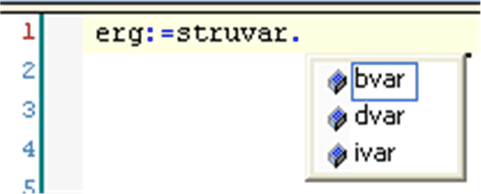
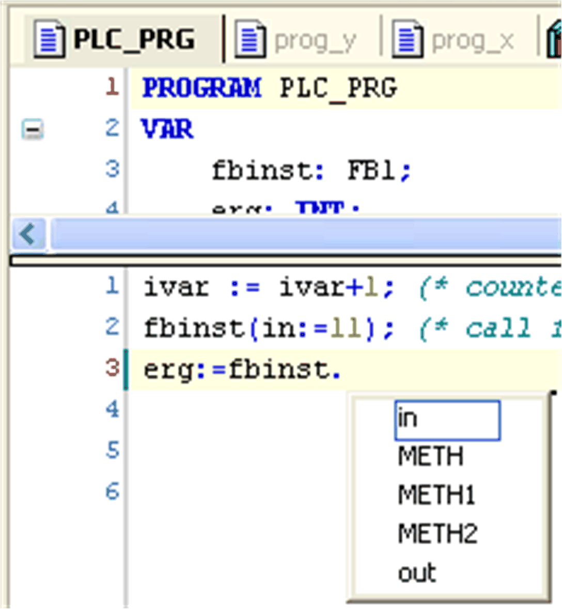

# Smart Coding

## Overview

Wherever identifiers (like variables or function block instances) can be entered (this can be inside of the IEC 61131-3 language editors or inside Watch, Trace, Visualization windows), the smart coding functionality is available. You can customize this feature in the SmartCoding section of the Tools > Options dialog box.

## Support in Identifier Insertion

The smart coding functionality helps to insert a correct identifier:

* If you - at any place, where a global identifier can be inserted - insert a dot (.) instead of the identifier, a selection box will display. It lists the currently available global variables. You can choose one of these elements and press the RETURN key to insert it behind the dot. You can also insert the element by double-clicking the list entry.
* If you enter a function block instance or a structure variable followed by a dot (.), then a selection box will appear. It lists the input and output variables of the corresponding function block or the structure components. You can choose the desired element by pressing the RETURN key or by double-clicking the list entry to insert it.
* In the ST editor, if you enter any string and press CTRL+SPACE, a selection box will display. It lists the POUs and global variables available in the project. The first list entry, which is starting with the given string, will be selected. Press the RETURN key to insert it into the program.

## Examples

The smart coding functionality offers components of structure:

The smart coding functionality offers components of a function block:

EIO0000002854.09