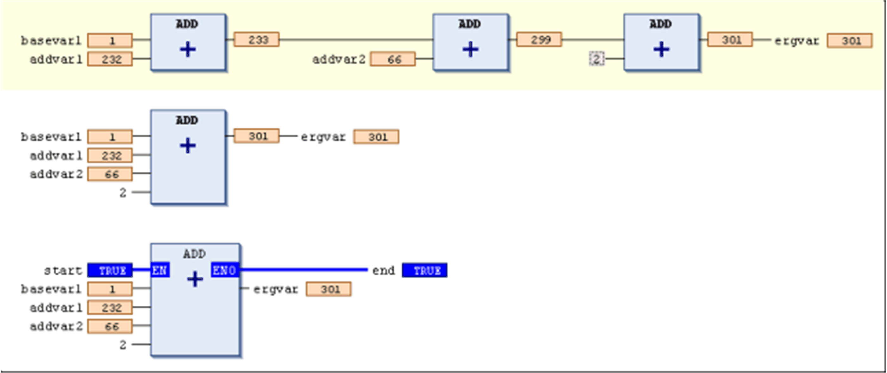

# `ADD`

## Overview

IEC operator for the addition of variables

Allowed types

* \_\_UXINT
* \_\_XINT
* \_\_XWORD
* BYTE
* DATE
* DATE\_AND\_TIME
* DINT
* DT
* DWORD
* INT
* LDATE
* LDATE\_AND\_TIME
* LDT
* LINT
* LREAL
* LTIME
* LTOD
* LWORD
* REAL
* SINT
* TIME
* TIME\_OF\_DAY
* TOD
* UDINT
* UINT
* ULINT
* USINT
* WORD

For time data types, the following combinations are possible:

* TIME+TIME=TIME
* TIME+LTIME=LTIME
* LTIME+LTIME=LTIME

For date and time data types, the following combinations are possible:

* TOD+TIME=TOD
* DT+TIME=DT
* TOD+LTIME=LTOD
* DT+LTIME=LDT
* LTOD+TIME=LTOD
* LDT+LTIME=LDT
* LTOD+LTIME=LTOD
* LDT+LTIME=LDT

In the FBD/LD editor, the `ADD` operator is an extensible box. This means, instead of a series of concatenated `ADD` boxes, you can use 1 box with multiple inputs. Use the command Insert Input for adding further inputs. The number is unlimited.

## Example in IL

```
LD     7
ADD    2
ADD    4
ADD    7
ST     iVar
```

## Example in ST

```
var1 := 7+2+4+7;
```

## Examples in FBD



**1.** series of `ADD` boxes

**2.** extended `ADD` box

**3.** `ADD` box with `EN/ENO` parameters

EIO0000002854.09