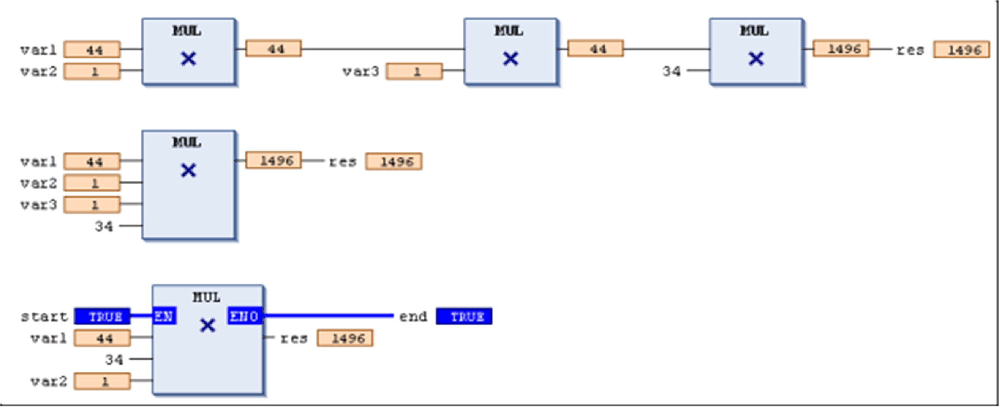

# `MUL`

## Overview

IEC operator for the multiplication of variables

Allowed types

* BYTE
* WORD
* DWORD
* LWORD
* SINT
* USINT
* INT
* UINT
* DINT
* UDINT
* LINT
* ULINT
* REAL
* LREAL
* TIME

TIME variables can be multiplied with integer variables.

In the FBD/LD editor, the `MUL` operator is an extensible box. This means, instead of a series of concatenated `MUL` boxes, you can use 1 box with multiple inputs. Use the command Insert Input for adding further inputs. The number is unlimited.

## Example in IL

```
LD     7
MUL    2     ,
       4     ,
       7
ST     Var1
```

## Example in ST

```
var1 := 7*2*4*7;
```

## Examples in FBD



**1.** series of `MUL` boxes

**2.** extended `MUL` box

**3.** `MUL` box with `EN/ENO` parameters

EIO0000002854.09