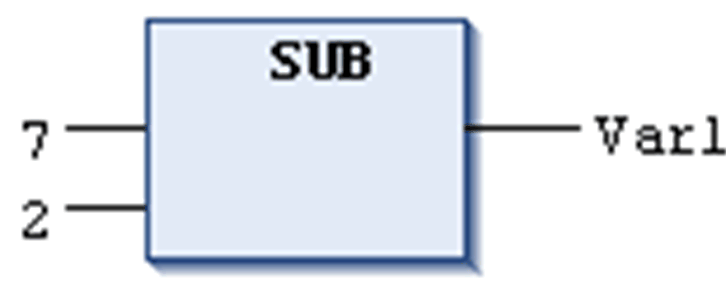

# `SUB`

## Overview

IEC operator for the subtraction of one variable from another one.

Allowed types:

* BYTE
* WORD
* DWORD
* LWORD
* SINT
* USINT
* INT
* UINT
* DINT
* UDINT
* LINT
* ULINT
* REAL
* LREAL
* TIME
* LTIME
* TIME\_OF\_DAY(TOD)
* LTIME\_OF\_DAY(LTOD)
* DATE
* LDATE
* DATE\_AND\_TIME(DT)
* LDATE\_AND\_TIME(LDT)

For time data types, the following combinations are possible:

* TIME–TIME=TIME
* LTIME–LTIME=LTIME

For date and time data types, the following combinations are possible:

* DATE–DATE=TIME
* LDATE–LDATE=LTIME
* TOD–TIME=TOD
* LTOD–TIME=LTOD
* TOD–TOD=TIME
* LTOD–LTOD=LTIME
* DT-TIME=DT
* LDT-LTIME=LDT
* DT-DT=TIME
* LDT–LDT=LTIME

Consider that negative TIME / LTIME values are undefined.

## Example in IL

```
LD     7
SUB    2
ST     Var1
```

## Example in ST

```
var1 := 7-2;
```

## Example in FBD



EIO0000002854.09