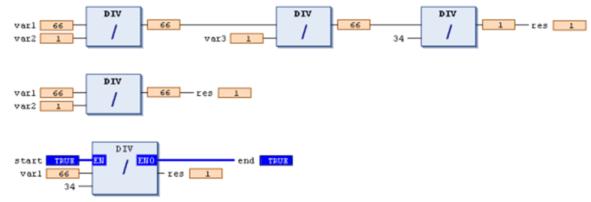

# `DIV`

## Overview

IEC operator for the division of one variable by another one:

Allowed types:

* BYTE
* WORD
* DWORD
* LWORD
* SINT
* USINT
* INT
* UINT
* DINT
* UDINT
* LINT
* ULINT
* REAL
* LREAL
* TIME

TIME variables can be divided by integer variables.

## Example in IL

(Result in `Var1` is 4.)

```
LD     8
DIV    2
ST     Var1
```

## Example in ST

```
var1 := 8/2;
```

## Examples in FBD



**1.** series of `DIV` boxes

**2.** single `DIV` box

**3.** `DIV` box with `EN/ENO` parameters

Different target systems may behave differently concerning a division by zero error. It can lead to a controller HALT, or may go undetected.

| WARNING | |
| --- | --- |
|  | UNINTENDED EQUIPMENT OPERATION  Use the check functions described in this document, or write your own checks to avoid division by zero in the programming code.  Failure to follow these instructions can result in death, serious injury, or equipment damage. |

NOTE: For more information about the implicit check functions, refer to the chapter [*POUs for Implicit Checks*](D-SE-0083416.html#D-SE-0083416).

## Check Functions

You can use the following check functions to verify the value of the divisor in order to avoid a division by 0 and adapt them, if necessary:

* `CheckDivDInt`
* `CheckDivLint`
* `CheckDivReal`
* `CheckDivLReal`

For information on inserting the function, refer to the description of the POUs for implicit checks [function](D-SE-0083416.html#D-SE-0083416).

The check functions are called automatically before each division found in the application code.

See the following example for an implementation of the function `CheckDivReal`.

## Default Implementation of the Function `CheckDivReal`

Declaration part

```
// Implicitly generated code : DO NOT EDIT
FUNCTION CheckDivReal : REAL
VAR_INPUT
 divisor:REAL;
END_VAR
```

Implementation part:

```
// Implicitly generated code : only an suggestion for implementation
IF divisor = 0 THEN
 CheckDivReal:=1;
ELSE
 CheckDivReal:=divisor;
END_IF;
```

The operator `DIV` uses the output of function `CheckDivReal` as a divisor. In the following example, a division by 0 is prohibited as with the 0 initialized value of the divisor `d` is changed to 1 by `CheckDivReal` before the division is executed. Therefore, the result of the division is 799.

```
PROGRAM PLC_PRG
VAR
 erg:REAL;
 v1:REAL:=799;
 d:REAL;
END_VAR
erg:= v1 / d;
```

EIO0000002854.09