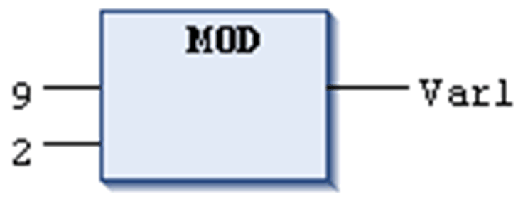

# `MOD`

## Overview

IEC operator for the modulo division of one variable by another one.

Allowed types:

* BYTE
* WORD
* DWORD
* LWORD
* SINT
* USINT
* INT
* UINT
* DINT
* UDINT
* LINT
* ULINT

The result of this function is the integer remainder of the division.

Different target systems may behave differently concerning a division by zero error. It can lead to a controller HALT, or may go undetected.

| WARNING | |
| --- | --- |
|  | UNINTENDED EQUIPMENT OPERATION  Use the check functions described in this document, or write your own checks to avoid division by zero in the programming code.  Failure to follow these instructions can result in death, serious injury, or equipment damage. |

NOTE: For more information about the implicit check functions, refer to the chapter [*POUs for Implicit Checks*](D-SE-0083416.html#D-SE-0083416).

## Example in IL

Result in `Var1` is 1.

```
LD     9
MOD    2
ST     Var1
```

## Example in ST

```
var1 := 9 MOD 2;
```

## Examples in FBD



EIO0000002854.09