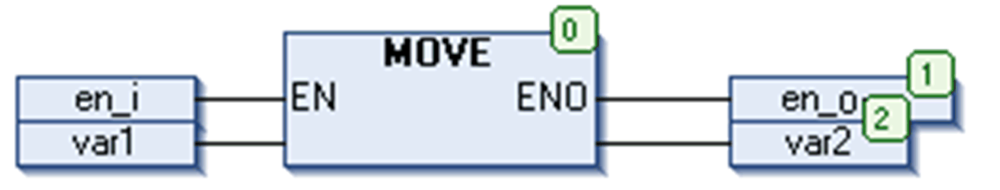

# `MOVE`

## Overview

IEC operator for the assignment of a variable to another variable of an appropriate data type.

The `MOVE` operator is possible for all data types.

As `MOVE` is available as a box in the graphic editors FBD, LD, CFC, there the (unlocking) `EN/ENO` functionality can also be applied on a variable assignment.

## Example in CFC in Conjunction with the `EN/ENO` Function

Only if `en_i` is TRUE, `var1` will be assigned to `var2`.



## Example in IL

Result: `var2` gets value of `var1`

```
LD     var1
MOVE
ST     var2
```

You get the same result with

```
LD     var1
ST     var2
```

## Example in ST

```
ivar2 := MOVE(ivar1);
```

You get the same result with

```
ivar2 := ivar1;
```

EIO0000002854.09