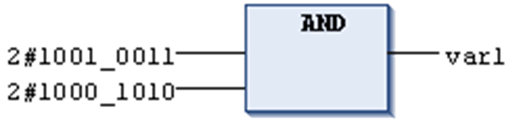

# `AND`

## Overview

IEC bitstring operator for bitwise AND of bit operands.

If the input bits each are 1, then the resulting bit will be 1, otherwise 0.

Allowed types:

* BOOL
* BYTE
* WORD
* DWORD
* LWORD

## Example in IL

Result in `Var1` is 2#1000\_0010.

```
Var1:BYTE;
```

```
LD     2#1001_0011
AND    2#1000_1010
ST     var1
```

## Example in ST

```
var1 := 2#1001_0011 AND 2#1000_1010
```

## Example in FBD



EIO0000002854.09