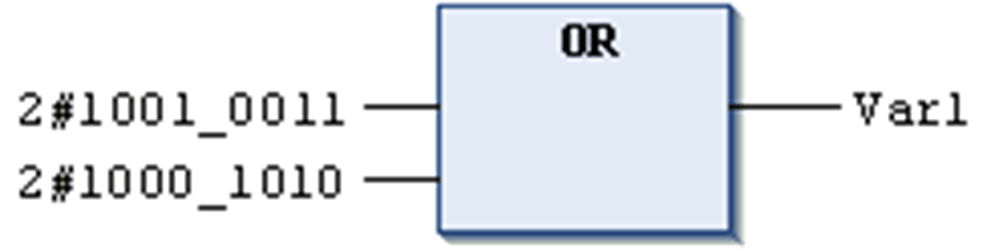

# `OR`

## Overview

IEC bitstring operator for bitwise OR of bit operands.

If at least 1 of the input bits is 1, the resulting bit will be 1, otherwise 0.

Allowed types:

* BOOL
* BYTE
* WORD
* DWORD
* LWORD

## Example in IL

Result in `var1` is 2#1001\_1011.

```
var1:BYTE;
```

```
LD     2#1001_0011
OR     2#1000_1010
ST     Var1
```

## Example in ST

```
Var1 := 2#1001_0011 OR 2#1000_1010
```

## Example in FBD



EIO0000002854.09