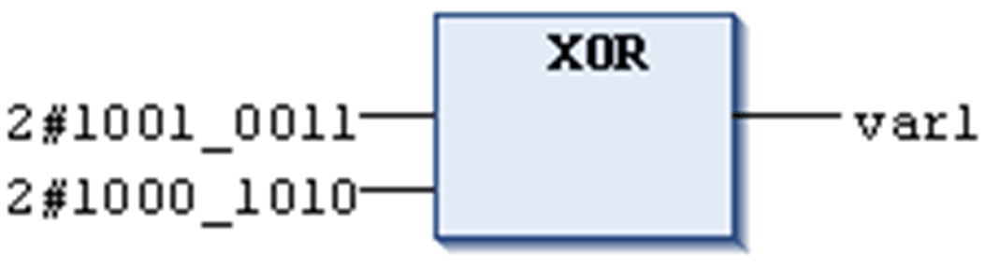

# `XOR`

## Overview

IEC bitstring operator for bitwise XOR of bit operands.

If only 1 of the input bits is 1, then the resulting bit will be 1; if both or none are 1, the resulting bit will be 0.

Allowed types:

* BOOL
* BYTE
* WORD
* DWORD
* LWORD

NOTE: `XOR` allows adding additional inputs. If more than 2 inputs are available, then an XOR operation is performed on the first 2 inputs. The result, in turn, will be XOR combined with input 3, and so on. This has the effect that an odd number of inputs will lead to a resulting bit = 1.

## Example in IL

Result is 2#0001\_1001.

```
Var1:BYTE;
```

```
LD     2#1001_0011
XOR    2#1000_1010
ST     var1
```

## Example in ST

```
Var1 := 2#1001_0011 XOR 2#1000_1010
```

## Example in FBD



EIO0000002854.09