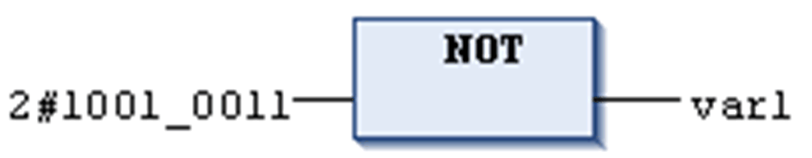

# `NOT`

## Overview

IEC bitstring operator for bitwise NOT operation of a bit operand.

The resulting bit will be 1 if the corresponding input bit is 0 and vice versa.

Allowed types

* BOOL
* BYTE
* WORD
* DWORD
* LWORD

## Example in IL

Result in `Var1` is 2#0110\_1100.

```
Var1:BYTE;
```

```
LD     2#1001_0011
NOT
ST     var1
```

## Example in ST

```
Var1 := NOT 2#1001_0011
```

## Example in FBD



EIO0000002854.09