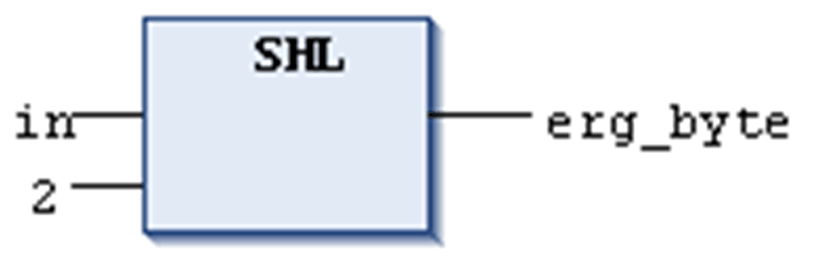

# `SHL`

## Overview

IEC operator for bitwise left-shift of an operand.

```
erg:= SHL (in, n)
```

`in`: operand to be shifted to the left

`n`: number of bits, by which `in` gets shifted to the left

NOTE: If `n` exceeds the data type width, it depends on the target system how BYTE, WORD, DWORD and LWORD operands will be filled. Some cause filling with zeros (`0`), others with `n MOD <register width>`.

NOTE: The amount of bits which is considered for the arithmetic operation depends on the data type of the input variable. If the input variable is a constant, the smallest possible data type is considered. The data type of the output variable has no effect at all on the arithmetic operation.

## Examples

See in the following example in hexadecimal notation the different results for `erg_byte` and `erg_word`. The result depends on the data type of the input variable (BYTE or WORD), although the values of the input variables `in_byte` and `in_word` are the same.

## Example in ST

```
PROGRAM shl_st
VAR
 in_byte : BYTE:=16#45; (* 2#01000101 )
 in_word : WORD:=16#0045; (* 2#0000000001000101 )
 erg_byte : BYTE;
 erg_word : WORD;
 n: BYTE :=2;
END_VAR
erg_byte:=SHL(in_byte,n); (* Result is 16#14, 2#00010100 *)
erg_word:=SHL(in_word,n); (* Result is 16#0114, 2#0000000100010100 *)
```

## Example in FBD



## Example in IL

```
LD     in_byte
SHL    2
ST     erg_byte
```

EIO0000002854.09