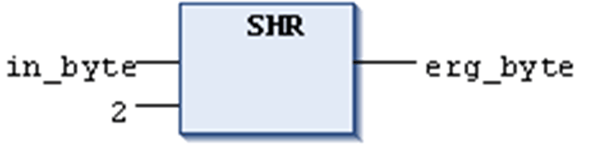

# `SHR`

## Overview

IEC operator for bitwise right-shift of an operand.

```
erg:= SHR (in, n)
```

`in`: operand to be shifted to the right

`n`: number of bits, by which `in` gets shifted to the right

NOTE: If `n` exceeds the data type width, it depends on the target system how BYTE, WORD, DWORD and LWORD operands will be filled. Some cause filling with zeros (`0`), others with `n MOD <register width>`.

## Examples

The following example in hexadecimal notation shows the results of the arithmetic operation depending on the type of the input variable (BYTE or WORD).

## Example in ST

```
PROGRAM shr_st
VAR
 in_byte : BYTE:=16#45; (* 2#01000101 )
 in_word : WORD:=16#0045; (* 2#0000000001000101 )
 erg_byte : BYTE;
 erg_word : WORD;
 n: BYTE :=2;
END_VAR
erg_byte:=SHR(in_byte,n); (* Result is 16#11, 2#00010001 *)
erg_word:=SHR(in_word,n); (* Result is 16#0011, 2#0000000000010001 *)
```

## Example in FBD



## Example in IL

```
LD     in_byte
SHR    2
ST     erg_byte
```

EIO0000002854.09