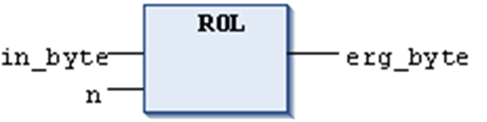

# `ROL`

## Overview

IEC operator for bitwise rotation of an operand to the left.

```
erg:= ROL (in, n)
```

Allowed data types

* BYTE
* WORD
* DWORD
* LWORD

`in` will be shifted 1 bit position to the left `n` times while the bit that is furthest to the left will be reinserted from the right

NOTE: The amount of bits which is considered for the arithmetic operation depends on the data type of the input variable. If the input variable is a constant, the smallest possible data type is considered. The data type of the output variable has no effect at all on the arithmetic operation.

## Examples

See in the following example in hexadecimal notation the different results for `erg_byte` and `erg_word`. The result depends on the data type of the input variable (BYTE or WORD), although the values of the input variables `in_byte` and `in_word` are the same.

## Example in ST

```
PROGRAM rol_st
VAR
in_byte : BYTE:=16#45;
in_word : WORD:=16#45;
erg_byte : BYTE;
erg_word : WORD;
n: BYTE :=2;
END_VAR
erg_byte:=ROL(in_byte,n); (* Result is 16#15 *)
erg_word:=ROL(in_word,n); (* Result is 16#0114 *)
```

## Example in FBD



## Example in IL

```
LD     in_byte
ROL    n
ST     erg_byte
```

EIO0000002854.09