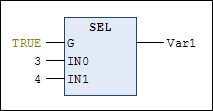
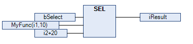
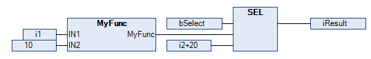

# `SEL`

## Overview

IEC selection operator for binary selection.

G determines whether IN0 or IN1 is assigned to OUT.

`OUT := SEL(G, IN0, IN1)` means:

`OUT := IN0;` if `G`=FALSE

`OUT := IN1;` if `G`=TRUE

Allowed data types:

`IN0`, `IN1`, and `OUT` can be any identical data type. Make sure that variables of the identical data type are used at these positions, especially when using user-defined data types. The compiler verifies the identity of the types and returns compiler errors. Assigning function block instances to interface variables is not supported.

`G`: BOOL

## Example in IL

```
LD  TRUE
SEL 3,4   (* IN0 = 3, IN1 =4 *)
ST  Var1  (* result is 4 *)
LD  FALSE
SEL 3,4
ST  Var1  (* result is 3 *)
```

## Example in ST

```
Var1:=SEL(TRUE,3,4); (* result is 4 *)
```

## Example in FBD



## Note

NOTE: When `G` is TRUE, a textual expression that precedes `IN0` is not computed.

When `G` is FALSE, a textual expression that precedes `IN1` is not computed.

In graphical programming languages, where a Box, Jump, Return, Line Branch, or Edge Detection is connected to `IN0` or `IN1`, these statements will always be computed, independently of the input `G`. This may have an impact on the amount of executed code and thus on the performance. Verify your code carefully to see whether the expressions connected to the inputs `IN0` and `IN1` should always be executed or only depending on the input `G`.

Example 1: `MyFunc` is directly connected to the input `IN1`. `MyFunc` is only executed if `bSelect` at the input `G` is FALSE:



Example 2: `MyFunc` is connected via a link to the input `IN1`. `MyFunc` is always executed (regardless whether `bSelect` at the input `G` is FALSE or TRUE):



EIO0000002854.09