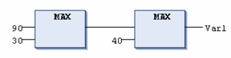

# `MAX`

## Overview

IEC selection operator performing a maximum function.

The `MAX` operator returns the greatest value of the inputs.

```
OUT := MAX(IN0, IN1, IN2,...)
```

`IN0`, `IN1`, `IN2`,... and `OUT` can be any type of variable.

## Example in IL

Result is 90

```
LD     90
MAX    30
MAX    40
MAX    77
ST     Var1
```

## Example in ST

Result is 90

```
Var1 := MAX(30,90,40);
Var1 := MAX(40,MAX(90,30));
```

## Example in FBD



EIO0000002854.09