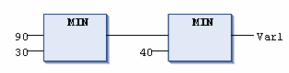

# `MIN`

## Overview

IEC selection operator performing a minimum function.

The `MIN` operator returns the smallest value of the inputs.

```
OUT := MIN(IN0, IN1, IN2,...)
```

`IN0`, `IN1`, `IN2`,... and `OUT` can be any type of variable.

## Example in IL

Result is 30

```
LD     90
MIN    30
MIN    40
MIN    77
ST     Var1
```

## Example in ST

```
Var1 := MIN(90,30,40);

Var1 := MIN(MIN(90,30),40);
```

## Example in FBD



EIO0000002854.09