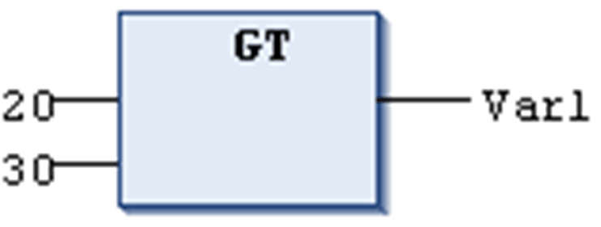

# `GT`

## Overview

Comparison operator performing a Greater Than function.

The `GT` operator is a boolean operator which returns the value TRUE when the value of the first operand is greater than that of the second.

[Elementary data types](D-SE-0083662.html#D-SE-0083662) are permitted as data types for the operands.

## Example in IL

Result is FALSE

```
LD     20
GT     30
ST     Var1
```

## Example in ST

```
VAR1 := 20 > 30;
```

## Example in FBD



EIO0000002854.09