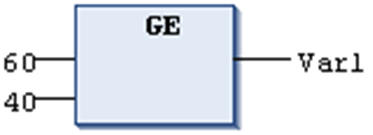

# `GE`

## Overview

Comparison operator performing a Greater Than Or Equal To function.

The `GE` operator is a boolean operator which returns the value TRUE when the value of the first operand is greater than or equal to that of the second.

[Elementary data types](D-SE-0083662.html#D-SE-0083662) are permitted as data types for the operands.

## Example in IL

Result is TRUE

```
LD     60
GE     40
ST     Var1
```

## Example in ST

```
VAR1 := 60 >= 40;
```

## Example in FBD



EIO0000002854.09