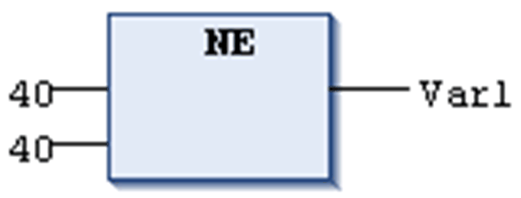

# `NE`

## Overview

Comparison operator performing a Not Equal To function.

The `NE` operator is a boolean operator which returns the value TRUE when the operands are not equal.

[Elementary data types](D-SE-0083662.html#D-SE-0083662) are permitted as data types for the operands.

## Example in IL

```
LD     40
NE     40
ST     Var1
```

## Example in ST

```
VAR1 := 40 <> 40;
```

## Example in FBD



EIO0000002854.09