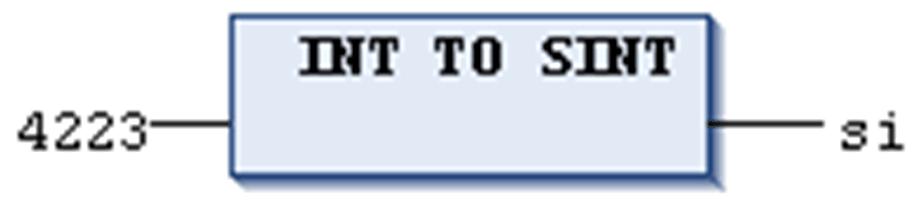

# Conversion Between Integral Number Types

## General Information

For general hints to be considered during type conversion, refer to the chapter [*Type Conversion Functions*](D-SE-0083726.html#D-SE-0083726).

## Definition

Conversion from an integral number type to another number type.

## Syntax

<INT data type>\_TO\_<INT data type>

For information on the integer data type, refer to the chapter [*Standard Data Types*](D-SE-0083662.html#D-SE-0083662__D-SE-0083662.4).

## Conversion Results

If the number you are converting exceeds the range limit, the first bytes for the number will be ignored.

## Example in ST

```
si := INT_TO_SINT(4223); (* Result is 127 *)
```

If you save the integer 4223 (16#107f represented hexadecimally) as a SINT variable, it will appear as 127 (16#7f represented hexadecimally).

## Example in IL

```
LD                4223
INT_TO_SINT
ST                si
```

## Example in FBD



EIO0000002854.09