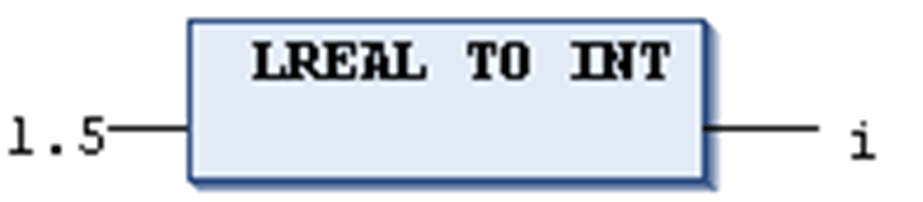

# REAL\_TO / LREAL\_TO Conversions

## General Information

For general hints to be considered during type conversion, refer to the chapter [*Type Conversion Functions*](D-SE-0083726.html#D-SE-0083726).

## Definition

IEC operator for conversions from the variable type REAL or LREAL to a different type.

The value will be rounded up or down to the nearest whole number and converted into the new variable type.

Exceptions to this are the following variable types:

* STRING
* BOOL
* REAL
* LREAL

NOTE: The rounding logic that is applied depends on the target system or the FPU (Floating Point unit) of the target system. A value of `-1.5` can thus be converted differently on different controllers.

## Conversion Results

If a REAL or LREAL is converted to SINT, USINT, INT, UINT, DINT, UDINT, LINT or ULINT and the value of the real number is out of the value range of that integer, the result will be undefined, and may lead to a controller exception.

NOTE: Validate any range overflows by your application and verify that the value of the REAL or LREAL is within the bounds of the target integer before performing the conversion.

When converting to type STRING, consider that the total number of digits is limited to six. If the (L)REAL number has more digits, then the sixth will be rounded. If the length of the STRING is defined too short, it will be cut from the right end.

## Example in ST

Examples in ST with conversion results:

| Example | Result |
| --- | --- |
| ``` i := REAL_TO_INT(1.5); ``` | `2` |
| ``` j := REAL_TO_INT(1.4); ``` | `1` |
| ``` i := REAL_TO_INT(-1.5); ``` | `–2` |
| ``` j := REAL_TO_INT(-1.4); ``` | `–1` |

## Example in IL

```
LD                2.75
REAL_TO_INT
ST                i
```

## Example in FBD



EIO0000002854.09