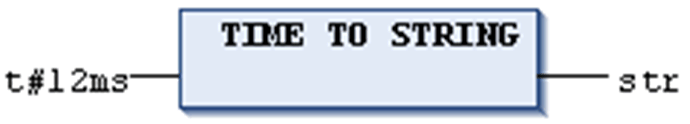
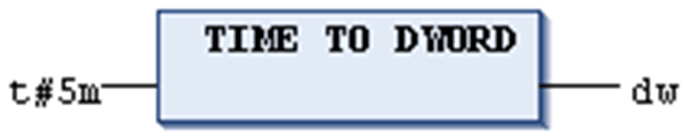
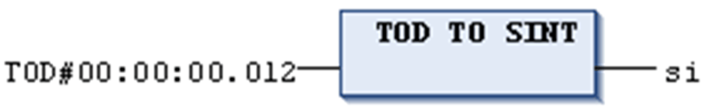

# TIME\_TO/TIME\_OF\_DAY Conversions

## General Information

For general hints to be considered during type conversion, refer to the chapter [*Type Conversion Functions*](D-SE-0083726.html#D-SE-0083726).

## Definition

IEC operator for conversions from the variable type TIME or TIME\_OF\_DAY to a different type.

## Syntax

TIME\_TO\_<data type>

TOD\_TO\_<data type>

## Conversion Results

The time will be stored internally in a DWORD in milliseconds (beginning with 12:00 A.M. for the TIME\_OF\_DAY variable). This value will then be converted.

In case of type STRING the result is a time constant.

NOTE: The operators that convert a value into a character string of type STRING or WSTRING require an operand that matches the target data type.

## Examples in ST

Examples in ST with conversion results:

| Example | Result |
| --- | --- |
| ``` str := TIME_TO_STRING(T#12ms); ``` | `'T#12ms'` |
| ``` dw := TIME_TO_DWORD(T#5m); ``` | `300000` |
| ``` si := TOD_TO_SINT(TOD#00:00:00.012); ``` | `12` |

## Examples in IL

Examples in IL with conversion results:

| Example | Result |
| --- | --- |
| ``` LD               T#12ms TIME_TO_STRI... ST               str ``` | `'T#12ms'` |
| ``` LD               T#300000ms TIME_TO_DWORD ST               dw ``` | `300000` |
| ``` LD               TOD#00:00:00.012 TIME_TO_SINT ST               si ``` | `12` |

## Examples in FBD







EIO0000002854.09