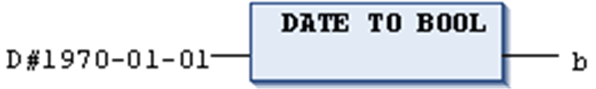
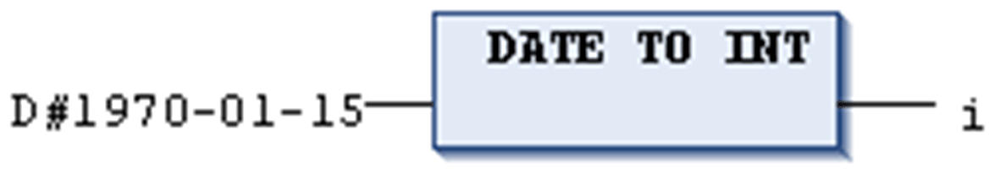
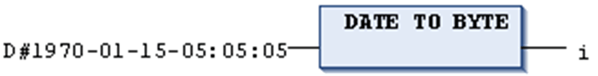
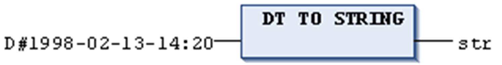

# DATE\_TO/DT\_TO Conversions

## General Information

For general hints to be considered during type conversion, refer to the chapter [*Type Conversion Functions*](D-SE-0083726.html#D-SE-0083726).

## Definition

IEC operator for conversions from the variable type DATE or DATE\_AND\_TIME to a different type.

## Syntax

DATE\_TO\_<data type>

DT\_TO\_<data type>

## Conversion Results

The date will be stored internally in a DWORD in seconds since Jan. 1, 1970. This value will then be converted.

For STRING type variables, the result is the date constant.

NOTE: The operators that convert a value into a character string of type STRING or WSTRING require an operand that matches the target data type.

## Examples in ST

Examples in ST with conversion results:

| Example | Result |
| --- | --- |
| ``` b := DATE_TO_BOOL(D#1970-01-01); ``` | `FALSE` |
| ``` i := DATE_TO_INT(D#1970-01-15); ``` | `29952` |
| ``` byt := DT_TO_BYTE(DT#1970-01-15-05:05:05); ``` | `129` |
| ``` str := DT_TO_STRING(DT#1998-02-13-14:20); ``` | `'DT#1998-02-13-14:20'` |

## Examples in IL

Examples in IL with conversion results:

| Example | Result |
| --- | --- |
| ``` LD            D#1970-01-01 DATE_TO_BOOL ST            b ``` | `FALSE` |
| ``` LD            D#1970-01-01 DATE_TO_INT ST            i ``` | `29952` |
| ``` LD            D#1970-01-15-05:05: DATE_TO_BYTE ST            byt ``` | `129` |
| ``` LD            D#1998-02-13-14:20 DATE_TO_STRI... ST            str ``` | `'DT#1998-02-13-14:20'` |

## Examples in FBD









EIO0000002854.09