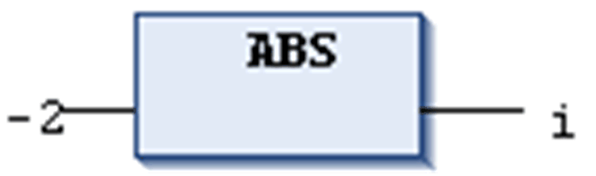

# `ABS`

## Definition

Numeric IEC operator for returning the absolute value of a number.

In- and output can be of any numeric data type.

## Example in IL

The result in `i` is 2.

```
LD                –2
ABS
ST                i
```

## Example in ST

```
i:=ABS(–2);
```

## Example in FBD



EIO0000002854.09