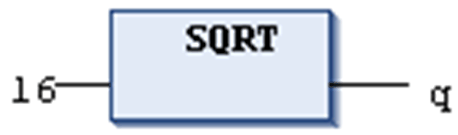

# `SQRT`

## Definition

Numeric IEC operator for returning the square root of a number.

The input variable can be of any numeric data type, the output variable has to be type REAL or LREAL.

## Example in IL

The result in `q` is 4.

```
LD                16
SQRT
ST                q
```

## Example in ST

```
q:=SQRT(16);
```

## Example in FBD



EIO0000002854.09