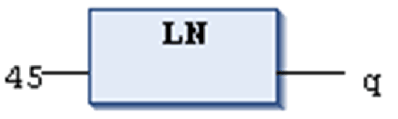

# `LN`

## Definition

Numeric IEC operator for returning the natural logarithm of a number.

The input variable can be of any numeric data type, the output variable has to be type REAL or LREAL.

## Example in IL

The result in `q` is 3.80666.

```
LD                45
LN
ST                q
```

## Example in ST

```
q:=LN(45);
```

## Example in FBD



EIO0000002854.09