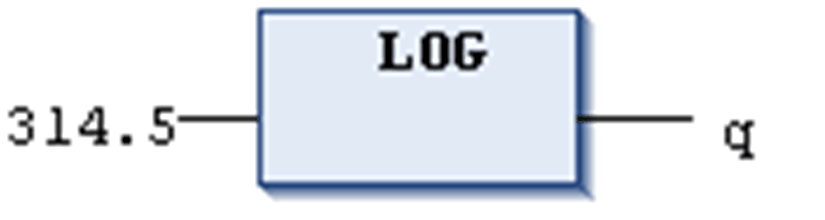

# `LOG`

## Definition

Numeric IEC operator for returning the logarithm of a number in base 10.

The input variable can be of any numeric data type, the output variable has to be type REAL or LREAL.

## Example in IL

The result in `q` is 2.49762.

```
LD                314.5
LOG
ST                q
```

## Example in ST

```
q:=LOG(314.5);
```

## Example in FBD



EIO0000002854.09