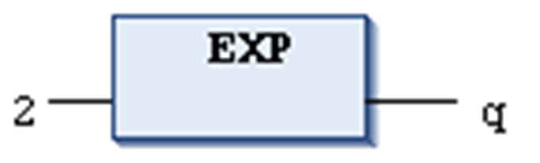

# `EXP`

## Definition

Numeric IEC operator for returning the exponential function.

The input variable can be of any numeric data type, the output variable has to be type REAL or LREAL.

## Example in IL

The result in `q` is 7.389056099.

```
LD                2
EXP
ST                q
```

## Example in ST

```
q:=EXP(2);
```

## Example in FBD



EIO0000002854.09