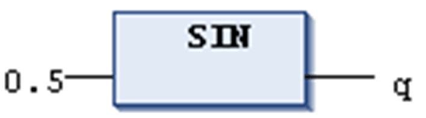

# `SIN`

## Definition

Numeric IEC operator for returning the sine of an angle.

The input defining the angle in radians and the output variable must be of type REAL or LREAL. The output type must correspond to the input type. Otherwise an error message will be displayed.

NOTE: The value range for the input value is −263...+263 which does not exactly correspond to the LREAL space of 64 bit (also refer to [REAL / LREAL](D-SE-0083662.html#D-SE-0083662__D-SE-0083662.5)). If the input value is beyond this range, the function returns the input value.

## Example in IL

The result in `q` is 0.479426.

```
LD                0.5
SIN
ST                q
```

## Example in ST

```
q:=SIN(0.5);
```

## Example in FBD



EIO0000002854.09